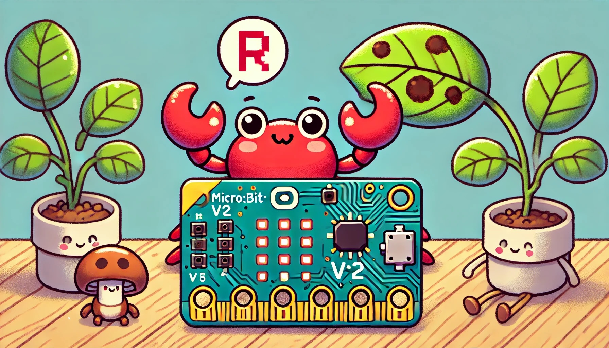

# Learn Rust by Games：The No-Frills Edition
[中文版](README_zh.md)

Author: Bin Wu

**Illustration: AI-generated. A crab and a micro:bit v2 development board sit beside a green leaf showing clear signs of rust fungus infection. Graydon Hoare, Rust language's creator, named it after rust fungus. These plant pathogens have complex life cycles with multiple hosts, enhancing their survival across various environments. Similarly, Rust ensures software stability through its strict, "over-engineered" enforcement of memory safety rules.**

## Introduction

"Learn Rust by Games: The No-Frills Edition" is a limited-share e-book under the CC BY-NC-ND 4.0 license. It offers a unique approach to learning Rust through game development—including embedded, web, and command-line games—while exploring common pitfalls and their solutions. Using game programming as a springboard, this book examines how professional programmers can leverage Rust for software development projects in the era of powerful generative AI. Throughout this journey, we uncover common traps and errors, making the learning experience more engaging, enjoyable, and motivating.

The "by games" aspect of the book's title highlights its suitability for two types of beginners: those with no programming experience at all, and those familiar with programming but new to embedded development. For beginners, games serve as ideal learning companions.

This book divides Rust fundamentals into three parts, each focusing on a specific type of game development. Each chapter's content revolves around the knowledge required to complete particular game projects. This structure offers a clear advantage: readers can quickly apply what they've learned, deepening their understanding of Rust.

**If you enjoy this e-book, please show your support with a star ⭐️!**

The chapter titles in this book will be continuously refined and adjusted throughout the writing process.

## Table of Contents

### Part One: Lighting Up LEDs

- Chapter 1: Why Should Beginners Learn Rust
- Chapter 2: Make Your First LED Blink
- Chapter 3: LED Text Scrolling Display
- Chapter 4: Accidentally Changing Code and Automated Testing
- Chapter 5: Memory Challenge Game and Variables
- Chapter 6: Virtual Pet Game and Ownership
- Chapter 7: Whack-a-Mole Game and Structs
- Chapter 8: Anti-Theft Alarm System and Error Handling
- Chapter 9: Reaction Test Game and Lifetimes
- Chapter 10: Snake Game and Unsafe Rust

### Part Two: Building Multi-threaded Web Games

- Chapter 11: Online Tic-Tac-Toe Game and Cargo
- Chapter 12: Multi-User Chat Room and Packages, Crates, and Modules
- Chapter 13: Customizable Card Battle Game and Generics
- Chapter 14: Online Multiplayer Werewolf Game and Traits
- Chapter 15: Collaborative Puzzle Game and Smart Pointers
- Chapter 16: Real-time Leaderboard and Concurrency
- Chapter 17: Real-time Strategy Game Server and Asynchronous Programming

### Part Three: Creating Fun Command-Line Games

- Chapter 18: Sudoku Game and Common Collection Types
- Chapter 19: Text Adventure Game and Enums
- Chapter 20: Riddle Guessing Game and Pattern Matching
- Chapter 21: Word Frequency Counter and Iterators
- Chapter 22: Custom Calculator and Closures
- Chapter 23: Command-Line Mini Game Engine and Macros
- Chapter 24: Role-Playing Game and Object-Oriented Programming
- Chapter 25: Multi-functional Command-Line Tool and Advanced Types
- Chapter 26: Publishing Games to [crates.io](http://crates.io) and Sharing the Joy
- Appendix

## Copyright License Agreement

["Learn Rust by Games: The No-Frills Edition"](https://github.com/wubin28/learn_rust_by_games) © 2024 by Author [Bin Wu](https://github.com/wubin28) is licensed under [CC BY-NC-ND 4.0](https://creativecommons.org/licenses/by-nc-nd/4.0/?ref=chooser-v1).

This book is licensed under the Creative Commons Attribution-NonCommercial-NoDerivatives 4.0 International License (CC BY-NC-ND 4.0).

This license allows you to share the book, but with the following strict limitations:

- Attribution (BY): When sharing, you must credit Bin Wu as the original author. This information must not be concealed or altered.
- NonCommercial (NC): The book is for non-commercial use only and may not be used for profit or commercial projects.
- NoDerivatives (ND): You may share the original version of this book, but you may not adapt, modify, or create derivative works. No changes or additions to the book's content are allowed.

Specifically, this license means:

- Share, but don't modify: You may share this book online, but it must remain in its original form without any modifications.
- No commercial use: The book must not be used in any commercial context, such as advertisements, publications, or paid projects.
- Protecting the original work's integrity: This license helps the author maintain the work's integrity and originality, preventing others from creating derivative works or using it commercially.

In essence, CC BY-NC-ND 4.0 is a relatively strict license. It allows free sharing of the book but prohibits any form of adaptation or commercial use.

## Book Code

You can download the code for this book from the GitHub repository at [https://github.com/wubin28/learn_rust_by_games](https://github.com/wubin28/learn_rust_by_games). Each code listing includes its specific location in the repository, making it easy for readers to find and run. The repository is organized by chapters, using the format chxx (where xx represents the chapter number).

## Development Environment Setup

To run the code in this book, you'll need the following equipment:

- A personal computer running Linux, macOS, or Windows 11 (Ubuntu is recommended for the best embedded development experience)
- A micro:bit v2 development board
- A USB micro data cable to connect the computer to the development board

Additionally, install the following software on your computer (detailed installation instructions are in Chapter 1):

- Git
- Rust
- Visual Studio Code (VS Code)

## Icons We Use

Throughout this book, we use specific icons to highlight different types of information:

- ✅ Call to action
- ⚠️ Warning or important detail that needs special attention
- 🔎 Deep dive into a topic—optional but enriching knowledge
- 💡 Helpful tips for exercises

## Acknowledgements

I extend my gratitude to Ms. Hailing Yang, editor at People's Posts and Telecommunications Press. Her keen perception of Rust programming as a trending topic, professional annotations for the initial chapters, and suggestion to share the e-book version for reader feedback were instrumental in shaping this work. Her efforts were the catalyst for creating this e-book.

I'm also thankful to the online friend "Don't Hit Xiao Lan" for their valuable input on the book's content. They offered three inspiring insights: the desire of programming beginners to complete a full project when learning Rust, the importance of discussing why beginners choose Rust, and the suggestion to create an English version to gather feedback from the international community where Rust might have a larger following. These perspectives led me to broaden the book's target audience from "readers with prior programming experience" to "complete beginners in programming or embedded development," and to prioritize the English version as the primary language.

## Frequently Asked Questions

### 1. Is this book suitable for programming beginners?

This book is ideal for two types of beginners: those with no programming experience whatsoever, and those familiar with programming but new to embedded development.

### 2. How does this book differ from other Rust learning resources?

We take a unique approach by teaching Rust concepts through the creation of engaging games, with a focus on embedded systems in Part One. Additionally, we explore common errors and pitfalls in learning Rust, helping readers gain a deeper understanding of the language's features and best practices.

### 3. Is this book complete?

The book is a work in progress, with an expected completion date around the end of July 2025. We regularly add and update chapters, so please check back often for the latest content.

### 4. How can I contribute to this book?

We welcome all contributions! If you find errors, have ideas for improvements, or want to add new content, please submit a PR or open an issue on our GitHub repository. Your feedback is invaluable in making this book better for all Rust beginners. If your contribution significantly impacts the book, I'll personally acknowledge you in the acknowledgments section.

### 5. Why is this a "No-Frills Edition"?

This edition is a precursor to a more comprehensive version planned for publication. We're sharing this limited version to gather reader feedback and refine the content. While this edition covers the core aspects of software project development for beginners, the published version will include additional content such as tips for using generative AI, common Rust learning pitfalls, and strategies to avoid them.

### 6. Is this book available in other languages?

Currently, we're writing the book in English and Chinese. If you're interested in translating it into other languages, please contact the author by opening an issue on our GitHub repository.

---

Thank you for your interest in "Learn Rust by Games: The No-Frills Edition"! We hope this book becomes a valuable resource on your Rust learning journey. Remember, the more pitfalls you encounter—and overcome—while writing games to learn Rust, the faster you'll progress. After all, those "pitfalls" often turn out to be our best teachers!