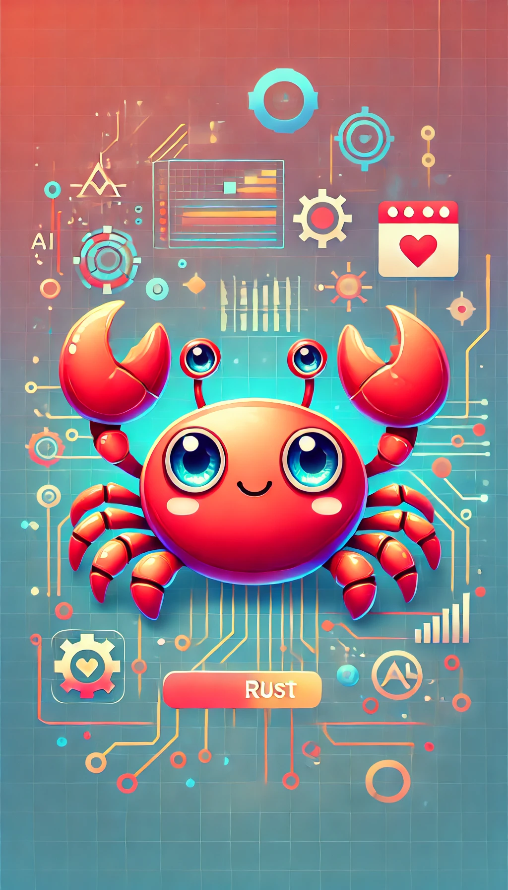

# 《从Rust小白到AI全栈师》（极简版）

[English Version](README.md)

作者：吾真本

**绘图：生成式AI。**

## 引言

[《从Rust小白到AI全栈师》（极简版）（From Rust Rookie to AI Full Stack: The No-Frills Edition）](https://github.com/wubin28/from-rust-rookie-to-ai-full-stack)是一本采用CC BY-NC-ND 4.0许可协议的免费共享电子书。本书通过编写一系列有趣的小游戏，帮助读者快速从Rust新手成长为掌握AI技能、能解决实际问题的全栈工程师。

本书采用独特方式**介绍Rust编程语言：让读者动手制作各类游戏，包括LED小游戏、命令行游戏、web游戏、WebAssembly游戏和AI模型训练游戏**。在编写游戏的过程中，我们将展示如何逐步向AI提出恰当问题，带领读者体验从需求分析到部署上线的完整过程。这不仅帮助理解Rust概念如何解决具体问题，还教会读者如何把可由AI处理的细节交给AI来完成。

本书书名中的"Rust小白"表明它特别适合两类初学者：完全没有编程经验的新手，以及有编程经验但尚未接触Rust的开发者。对于想学习Rust嵌入式开发的程序员，可以在完成第一章并点亮第一个LED后，转向其他专门的Rust嵌入式开发书籍。虽然本书第一部分涉及Rust嵌入式开发，但整体重点仍在Rust编程语言本身。我们之所以从micro:bit v2嵌入式开发开始，是因为用Rust代码控制闪闪的LED和萌萌的小按钮实在太迷人了。

本书将Rust入门知识分为五篇，分别聚焦嵌入式、命令行、Web、WebAssembly和AI模型训练游戏开发。每一章都精心设计了与特定Rust知识相关的游戏。这种编排方式具有显著优势：读者能够通过实践5个不同领域的Rust项目，快速成长为AI全栈工程师。

相比其他Rust编程入门书籍，本书在为Rust小白读者打造超好学习体验方面具有以下特色：

- **学一点用一点**：让小白能在学习过程中快速体验收获感
- **解决问题优先**：每个新概念和工具都与具体问题相对应，让你明白它们的实际用途
- **问AI好问题**：提供提升AI回答准确度的有效提问方式

**如果你喜欢这本电子书，请给它点个星⭐️！**

本书各章的标题将随着撰写过程不断优化和调整。

## 目录

### 第一篇 点亮LED灯

- 第1章 点亮第一个LED灯与Rust的爽点
- 第2章 让第一个LED灯闪烁与编程神器
- 第3章 记忆力挑战游戏与变量
- 第4章 电子宠物游戏与所有权
- 第5章 打地鼠游戏与结构体

### 第二篇 制作有趣的命令行游戏

- 第6章 无尽的井字棋与错误处理
- 第7章 打字速度测试游戏与生存期
- 第8章 迷宫生成与自动化测试
- 第9章 任务管理模拟游戏与Cargo
- 第10章 发布文字冒险游戏到crates.io分享快乐

### 第三篇 打造多线程web游戏

- 第11章 多人聊天室与包、crate和模块
- 第12章 可定制卡牌对战游戏与泛型
- 第13章 多人在线狼人杀与trait
- 第14章 协作式拼图游戏与智能指针
- 第15章 实时排行榜与并发
- 第16章 实时多人射击游戏与unsafe Rust
- 第17章 即时战略游戏服务器与异步

### 第四篇 编写好玩的WebAssembly游戏

- 第18章 俄罗斯方块与常用集合类型
- 第19章 棋盘游戏与枚举
- 第20章 事件响应游戏与模式匹配
- 第21章 虚拟宠物养成与面向对象

### 第五篇 点燃AI模型训练之火

- 第22章 数据加载与迭代器
- 第23章 构建神经网络与闭包
- 第24章 自动化模型训练与宏
- 第25章 AI模型封装与高级类型

## 版权许可协议

[《从Rust小白到AI全栈师》（极简版）（From Rust Rookie to AI Full Stack: The No-Frills Edition）](https://github.com/wubin28/from-rust-rookie-to-ai-full-stack)© 2025 作者 [吾真本](https://github.com/wubin28) 采用 [CC BY-NC-ND 4.0](https://creativecommons.org/licenses/by-nc-nd/4.0/?ref=chooser-v1) 许可协议授权。

本书采用知识共享署名-非商业性使用-禁止演绎 4.0 国际许可协议（CC BY-NC-ND 4.0）进行许可。

该协议允许你分享本书，但有以下严格限制：

- 署名（BY）：分享时必须注明吾真本为原作者，不得隐瞒或更改此信息。
- 非商业性使用（NC）：本书仅限非商业用途，不得用于盈利或商业项目。
- 禁止演绎（ND）：你可以分享本书的原始版本，但不得改编、修改或重新创作。换言之，不能对本书内容进行任何改变或添加。

这个协议具体意味着：

- 可以分享，但不得更改：你可以在网上分享本书，但必须保持原样，不得修改任何内容。
- 禁止商业用途：本书不得用于任何商业环境，如广告、出版物或付费项目。
- 保护原作完整性：此协议帮助原作者维护作品的完整性和原创性，防止他人进行二次创作或商业利用。

简而言之，CC BY-NC-ND 4.0 是一个相对严格的协议。它允许自由分享本书，但禁止任何形式的改编或商业利用。

## 本书代码

本书代码可在GitHub上的https://github.com/wubin28/from-rust-rookie-to-ai-full-stack代码库中下载。每个代码清单都标注了其在代码库中的具体位置，方便读者查找和运行。代码库按章节组织，格式为chxx（xx为章节编号）。

## 开发环境准备

要运行本书代码，请根据你的计算机的操作系统准备以下设备和软件：

| **你的计算机的操作系统** | **Linux（原生或在Windows 10/11的WSL2中使用）** | **macOS** | **Windows 10/11** |
| --- | --- | --- | --- |
| micro:bit v2开发板 | 1块 | （同左） | （同左） |
| USB micro数据线 | 1根 | （同左） | （同左） |
| 命令行shell | bash | zsh（macOS Catalina 10.15及之后）; bash（macOS Catalina 10.15之前） | cmd (Command Prompt) |
| Rust | 需要 | （同左） | （同左） |

由于在Windows 10/11的WSL2中使用Linux对初学者来说较为复杂，本书暂不详述。其他操作系统的开发环境配置详见第1章。

## 使用的图标

在本书中，我们使用特定的图标来突出显示不同类型的信息：

- ❓问AI好问题
- 💡 AI回复要点
- 👍Rust概念如何解决具体问题
- 🤖可交给AI处理而无需死记硬背的Rust概念细节
- ✅ 行动及好处
- ⚠️ 需要特别注意的踩坑场景及避坑要点
- 🔎 深入探讨主题——可选但有助于扩展知识

## 致谢

感谢人民邮电出版社编辑杨海玲老师。她敏锐地察觉到Rust编程这一热门趋势，以专业出版物的标准为本书前几章提供了批注，并建议作者向读者分享电子版，以获取更多反馈来提升本书质量。正是她的这些努力促成了本电子书的诞生。

感谢网友"别打小兰"对本书内容构思提供的宝贵建议。他提出了三个极具启发性的观点：一是编程新手在学习Rust时希望能完成一个从头到尾的完整项目；二是探讨新手为何选择学习Rust；三是增加英文版，以获取国外（Rust在那里可能更受欢迎）读者的反馈。这些见解促使作者重新考虑了本书的目标读者群体，将其从"至少掌握一门编程语言的读者"扩展到"编程或嵌入式开发可以是零基础的读者"，并将英文版作为默认语言版。

## 常见问题

### 1. 这本书适合编程小白吗？

本书特别适合两类小白：完全没有编程经验的新手，以及有编程经验但未接触过Rust或嵌入式开发的人士。

### 2. 这本书与其他 Rust 学习资源有何不同？

本书采用了独特的方法，通过编写丰富多彩的游戏（尤其是第一部分的嵌入式游戏）来教授Rust的各种概念。同时，它探索了如何有效地召唤AI这个Rust私教，来帮助读者深入理解Rust的特性和最佳实践。

### 3. 这本书完成了吗？

这本书正在持续撰写中，预计2025年底前后写完。我们会定期添加和更新章节。请经常回来查看最新的内容和更新。

### 4. 我如何为这本书做出贡献？

我们热烈欢迎各种形式的贡献！如果你发现任何错误、有改进建议或想添加新内容，欢迎在GitHub代码库上参与discussion、提交PR或开启issue。你的宝贵意见将帮助这本书变得更好，让所有Rust初学者受益。如果你的贡献给我留下深刻印象，我会在本书致谢部分特别感谢你。

### 5. 这本书为何是极简版？

本书计划通过出版社出版。在创作过程中，我们采用有限共享的极简版形式来获取读者反馈，以便改进内容。出版社版本将包含更丰富的内容。两个版本的主要区别是：极简版提供小白开发软件项目全过程的核心要点；而出版社版本则增加了如何向AI提出好问题及AI回复要点、Rust概念如何解决具体问题、哪些Rust概念细节可交给AI处理而无需死记硬背等增值内容，从而提升了出版社版本的价值。

### 6. 这本书有其他语言版本吗？

目前，这本书正在用中文编写。如果你有兴趣将本书翻译成其他语言，请通过在这个GitHub仓库上开启一个issue来联系作者。

### 7. 如果我按照书中内容操作遇到问题该怎么办？

你可以先尝试根据出错信息在网上搜索解决方案，或者咨询你常用的生成式AI。如果仍然无法解决，可以茄作者薇薪wuzhenben001（请备注"aifs"），我会抽空为你解答。

---

感谢你对[《从Rust小白到AI全栈师》（极简版）（From Rust Rookie to AI Full Stack: The No-Frills Edition）](https://github.com/wubin28/from-rust-rookie-to-ai-full-stack)的关注！希望这本书能成为你的Rust学习旅途中的得力助手。记住，只要掌握向AI提问的技巧，再加上你的好奇心，你就能从Rust小白快速成长为AI全栈师。
