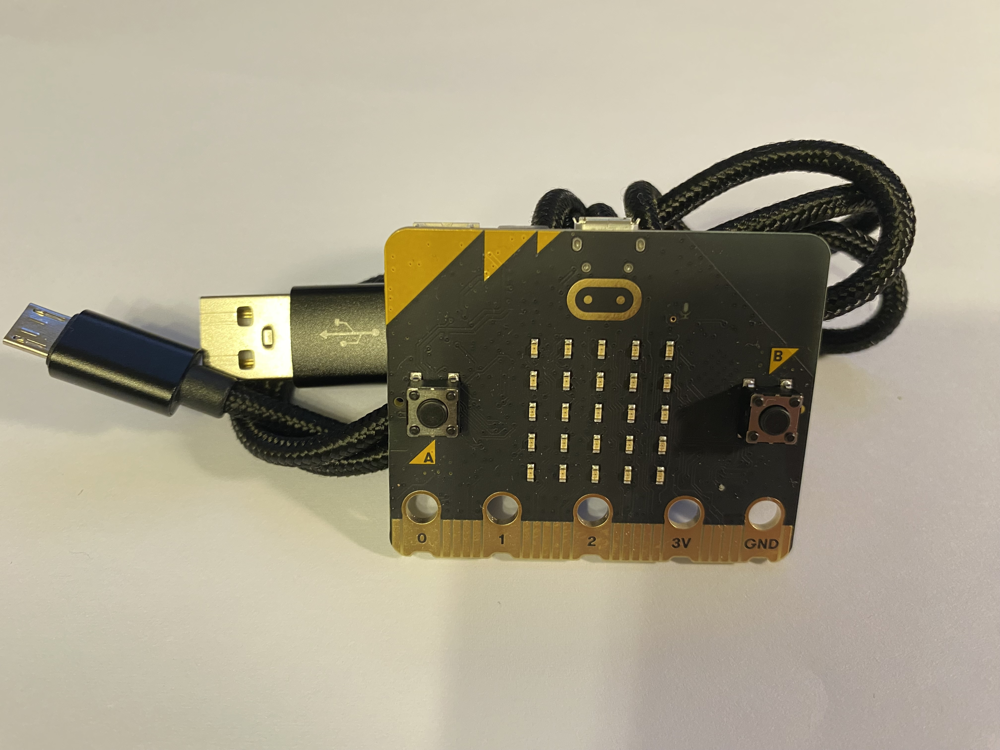
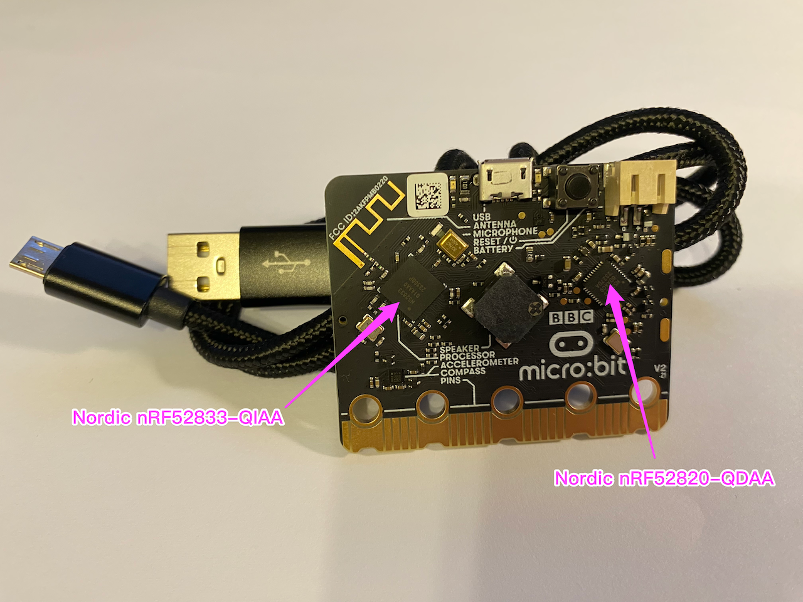
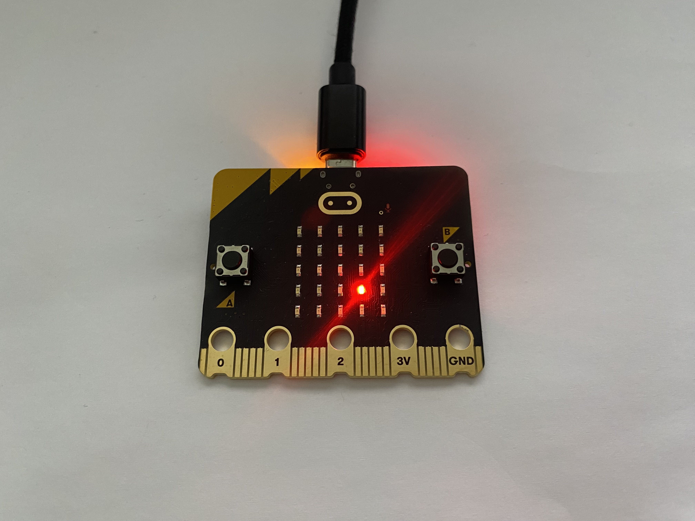

# Chapter 1: Light Up Your First LED and Programming Supertools

"As a programming beginner, why do you want to learn Rust?" I asked rusty_rookie on WeChat.

I'm a veteran programmer with over 30 years of IT experience, writing a Rust programming book for beginners to help smooth out its famously steep learning curve. Rusty_rookie, a friend I recently met on social media, is passionate about learning Rust. As a master's graduate in Environmental Engineering working at a Beijing company for three years, he dreams of becoming an independent software developer. Though his programming experience is limited—some C from college basics, a bit of C++, and Python for data analysis during grad school—he's eager to create his own software. While he appreciated the convenience of writing and running short Python scripts in Jupyter without debugging, he never felt it was **real programming**.

Rusty_rookie shared his motivation for learning Rust, beginning with his seven-year journey using the LaTeX markup language.

# 1.1 The Joy of Rust Isn't Actually Memory Safety

LaTeX, developed by Leslie Lamport in 1984, is a document typesetting system built on TeX—a powerful system created by Donald Knuth in 1978. Known for its precision and flexibility, TeX excels at typesetting scientific literature and complex mathematical formulas. LaTeX makes TeX more accessible by introducing macro packages and high-level commands that separate document structure from content. It's the go-to choice for documents needing consistent formatting and elegant typesetting, such as academic papers, technical reports, and books. While LaTeX has a steep learning curve, mastering it leads to significant improvements in document preparation efficiency and typesetting quality.

In the LaTeX ecosystem, macros serve as quick, customizable shortcuts—essentially abstractions of low-level commands. Users can create their own macro commands to streamline typesetting tasks. Packages bundle these predefined macro commands into collections of related functionality. Like libraries in modern programming languages, packages extend LaTeX's core capabilities to handle complex typesetting needs, though they still rely on macros as their fundamental building blocks.

Rusty_rookie encountered a significant problem with LaTeX: **the package management user experience isn't good enough**. LaTeX lacks built-in package management tools, instead relying on TeX distributions like TeX Live and MiKTeX. While these distributions offer package management tools, they're overly complicated for users.

Consider TeX Live as an example—it uses an annual release model. Users must reinstall the entire distribution when upgrading to a new version, rather than using the package manager tlmgr (TeX Live Manager). This is because tlmgr can only manage packages within the current year's release. While this design ensures package compatibility with the TeX engine, it's inconvenient for users who need frequent updates.

CTAN (The Comprehensive TeX Archive Network, the core repository network for TeX and LaTeX resources, similar to Linux's software repositories or Python's PyPI) suffers from package redundancy. For tables alone, hundreds of packages exist, forcing users to spend considerable time finding the right one.

Package compatibility presents another challenge. While users can resolve conflicts by reading documentation or asking the community for help, this process is often tedious and time-consuming.

Recently, rusty_rookie discovered Typst, a new typesetting system from the open-source community. Built with Rust, this project aims to challenge LaTeX's dominance. The name "Typst" cleverly merges "type" and "Rust," reflecting its modern approach to typesetting. The project has already gained significant traction, earning 35.2k stars on GitHub.

Despite his frustration with LaTeX's package management, rusty_rookie had grown attached to the tool over years of use. He initially tried Typst with skepticism, hoping to defend LaTeX.

Instead, Typst's impressive compilation speed and user experience won him over, turning him from a skeptic into an enthusiast.

Typst features a built-in package manager (inspired by Cargo, Rust's package manager) that handles packages without external tools or extra configuration, streamlining the entire workflow. In contrast, LaTeX relies on distribution-specific tools like TeX Live and MiKTeX, with varying functionality across distributions.

Typst automatically detects document dependencies and installs missing packages as needed, while offering one-click updates for all packages. This eliminates manual searching and installation. LaTeX, on the other hand, requires users to manually update packages through commands, and older distributions may not support the latest macro packages.

Typst's package management system can also lock specific package versions, ensuring consistent typesetting across different environments. LaTeX lacks this unified version control, leading to potential inconsistencies in macro package behavior across different systems and TeX engine versions.

With its modern toolchain design, Typst handles package compatibility automatically. This is a significant improvement over LaTeX, where users often must wade through macro package documentation and manually adjust code to resolve conflicts—making Typst much more accessible to newcomers.

Typst employs an on-demand download model, enhancing efficiency by downloading only necessary packages. This contrasts with LaTeX's approach, which often requires installing large package collections (a complete TeX Live installation can exceed several GB).

Typst's rolling update system enables rapid adoption of community improvements. While LaTeX offers network-based updates, most users opt for the annual update cycle for stability—a choice that delays the adoption of new features.

From its inception, Typst inherited Rust's excellent traditions—**emphasizing modern toolchain design and exceptional user experience**. This gives Typst distinct advantages in beginner-friendliness and ease of use. While LaTeX offers a rich ecosystem and mature functionality, its package management remains a significant pain point.

In StackOverflow's 2024 embedded development survey, Rust's package manager and build tool Cargo earned outstanding marks, with 83% of respondents strongly endorsing it. This showcases not only Cargo's stellar reputation among embedded developers but also its seamless blend of power and usability. The survey highlights how embedded developers value development efficiency and user experience, while underscoring Rust's growing prominence in embedded development.

Through Typst, rusty_rookie unexpectedly discovered Rust and developed a keen interest in the language.

While the software industry focuses heavily on Rust's memory safety features, rusty_rookie's motivation for learning Rust struck me as both logical and fresh. Rust's **user-friendly native development tools** and **clear, friendly compilation error messages** (rusty_rookie noted that LaTeX's cryptic errors discourage 90% of newcomers, while some programmers admit C++'s error messages shake their confidence)—though perhaps less crucial than memory safety to professional developers and organizations—are exactly what matter most to newcomers like rusty_rookie.

People often describe Rust's learning curve as steep, but this view typically comes from those with C++ or Java backgrounds. For programming newcomers like rusty_rookie, **their blank slate is actually an advantage**—they're starting fresh with any language. Unlike C++ or Java programmers who've already formed fixed programming habits, **rusty_rookie might grasp Rust more naturally**.

Despite my formal computer science education, I too was once a programming novice like rusty_rookie. I understand that **beginners thrive on exciting, engaging learning experiences**. Blinking LEDs on development boards and colorful game projects spark far more enthusiasm than dry textbook concepts. Let's dive in and experience Rust's excellent design by lighting up our first LED!

# 1.2 Game Preparation

The Part One of this book will guide you through creating fun games on the micro:bit v2 development board using Rust. Just plug the USB charging port into the breadboard, and you'll see "RUST" scroll brilliantly across this palm-sized micro:bit v2 board, **lighting up your desk all day**. That's far more engaging than running a simple string program in your laptop's terminal, only to close the lid and forget about it. Take a look at Figure 1 to see what I mean.


Figure 1-1 Scrolling display of "RUST" on the micro:bit v2 development board

The games in this first section introduce you to embedded development. But what exactly is embedded development?

## 1.2.1 Embedded Development

Embedded development is **the process of writing software for specialized hardware devices**. These devices have **specific functions** and **limited resources** (such as memory and processing power), balancing cost with functionality. You'll find embedded systems in everyday devices like washing machines, car control systems, and smartwatches.

This field emerged in the 1960s with pioneering projects like the Apollo Guidance Computer and the D-17B computer for the Minuteman I NS-10Q missile guidance system.

Embedded systems have a special charm. Think of them as skilled artisans, each dedicated to a specific task. Though they work with limited resources—like living in a tiny house—they perform their tasks with remarkable efficiency. They react with impressive speed, making split-second decisions like race car drivers.

While these devices must follow strict hardware rules, these very constraints make them more reliable. They're like tireless sentinels, working continuously with unwavering focus.

The advantages of embedded systems are clear: they work efficiently, use minimal power, and help protect the environment. Their small size lets them fit anywhere, and their affordability brings technology to more people.

Yet embedded development comes with its challenges. Developers must understand both hardware and software—it's like mastering two crafts at once. Debugging often means solving mysteries with limited clues. Adding features requires careful planning, and managing resources demands precise balance.

You'll find embedded systems everywhere: in your home appliances and smart speakers, in factory machines, in modern cars, in city infrastructure, and in precise medical equipment. They're quietly transforming how we live.

By combining hardware design with software development, embedded development appeals especially to those curious about how electronic devices work and eager to build things with their hands.

Since its 1.0 release in 2015, Rust has captured the attention of embedded developers through its user-friendly toolchain, excellent memory safety, and performance that rivals C.

In embedded development, Rust functions like a skilled butler—ensuring safe and efficient code execution while expertly managing limited-resource devices. It safeguards devices and minimizes memory errors while handling complex tasks with remarkable efficiency.

This butler's capabilities shine in several ways: it catches potential issues before code runs, operates without requiring a heavy operating system—essential for space-constrained devices—and offers modern development tools that streamline the entire process.

Rust's strengths are clear: beyond ensuring code safety, it simplifies complex operations without sacrificing performance. Like a seasoned engineer, it crafts elegant code while maximizing limited resources.

Naturally, Rust presents some challenges. Learning it demands time and patience, similar to mastering any sophisticated craft. While its ecosystem continues to grow and compilation times can be lengthy, these trade-offs are worthwhile for the resulting code quality.

Rust proves especially valuable in high-security applications like medical devices and aviation systems. Its lightweight design has made it a favorite for IoT devices, and its performance excellence suits real-time systems perfectly. The education sector has also embraced it as an ideal tool for training future developers.

In embedded development, Rust brilliantly balances modern innovation with time-tested principles, enabling us to build more secure and dependable embedded systems.

Let's embark on this exciting journey! We'll take our first step into embedded development by lighting up an LED with Rust code!

## 1.2.2 Adjusting Your Mindset

As a newcomer to embedded programming, what mindset should you adopt? From my experience, the most important thing is learning to **accept the fear that comes with programming pitfalls—like standing by a stream, calmly watching leaves of fear float by, rather than falling into the river**.

This fear is a natural part of growth. In my decades of programming, I've faced countless mysterious error messages in command lines and logs, sometimes doubting my own abilities. Yet each time I found a solution—whether through deep thinking or with help from experts, search engines, and AI—I felt a surge of pride. So when you face similar challenges on your programming journey, I'm actually excited for you. Every time you climb out of these "pitfalls" through your own efforts, you're taking a significant step toward becoming a real programmer. Keep going!

## 1.2.3 Roadmap for Lighting Your First LED

| Step | Description |
| --- | --- |
| 1. Hardware Setup | Prepare micro:bit v2 board and USB micro data cable |
| 2. Software Installation | Install Rust |
| 3. Code Generation | Generate LED lighting code using `cargo generate` |
| 4. Cross Compilation | Install target platform:`rustup target add thumbv7em-none-eabihf`<br>Cross compile:`cargo build` |
| 5. Flash and Run | Install flashing tool probe-rs<br>Flash and run:`cargo run` |
| 6. Explain the Code | General Rust project management files: Cargo.toml and Cargo.lock<br>Cargo tool behavior and project build environment configuration file: .cargo/config.toml<br>Embedded development specific configuration file: Embed.toml<br>Rust source code entry file: src/main.rs |

## 1.2.4 Preparing the Hardware

To light up your first LED, you'll need a **computer**—either desktop or laptop—running Linux, macOS, or Windows 10/11. I wrote this book using three different systems: Ubuntu 24.04.1 LTS, macOS Sonoma 15.1.1, and Windows 11 Pro 23H2. Due to space constraints, we'll focus on these three operating systems. If you're using something different, you can still follow along and seek help from your preferred AI assistant.

🔎 If you're interested, you can also use Microsoft's WSL 2 on Windows for Linux development, though we won't cover this advanced option in the book.

While Linux is recommended for the embedded development sections due to its comprehensive toolchain, both Windows and macOS will work perfectly well for everything in this book.

Next, let me introduce an exciting device—the **micro:bit v2 development board**, as shown in Figures 1-2 and 1-3.



Figure 1-2: The front view of the micro:bit v2, featuring the product name, integrated chips, reset button, and USB micro data cable


Figure 1-3 The back of the micro:bit v2, showing the 5×5 LED matrix and buttons on both sides

It all began with a group of creative engineers at the British Broadcasting Corporation (BBC). Noticing how children were absorbed in mobile phone games but showed little interest in creating technology, they had an idea: why not design a simple, fun gadget that would let children experience the joy of creation? This led to the micro:bit v1. In 2015, they distributed this small device as a special gift to one million British secondary school students. It proved wildly popular and quickly spread worldwide.

Five years later came the micro:bit v2. This "magic box"—smaller than a credit card—packs impressive features: an LED matrix display, two buttons, and various environmental sensors. At its heart lies the Nordic nRF52833 chip, which combines Bluetooth connectivity with remarkable power efficiency.

For programming beginners, the micro:bit is an ideal starting tool. You can begin with block-based programming, move on to Python, and eventually try Rust. All you need is a USB cable and a computer to start creating—the process is as intuitive as building with blocks. Don't worry if you're heading straight for Rust; this book doesn't require any prior Python knowledge.

The magic of this little device lies in making learning fun. Whether creating an alarm clock or measuring room temperature, everything feels achievable. Better still, a global community of enthusiasts shares ideas, ensuring you're never alone on your learning journey.

The micro:bit does have limitations: it can't handle complex programs or industrial applications. Yet these constraints become advantages for beginners—simple functions let you focus on the joy of creation. It's affordable too, costing about the same as two or three cups of coffee.

So whether you're a student learning to code, a parent wanting to spark your children's creativity, or an enthusiast eager to develop simple smart devices, the micro:bit is perfect. It's your key to the creative world—one gentle turn opens the door to programming's wonderful possibilities.

Additionally, you'll need a standard **USB micro data cable** to connect your computer's USB port to the micro:bit v2's USB port. This data cable typically comes included when you purchase a micro:bit v2.

New micro:bit v2 development boards usually work perfectly out of the box, but it's reassuring to test them. Fortunately, testing is simple since the code is already prepared—no writing required.

✅How to verify that your newly purchased micro:bit works properly?

You can visit the [micro:bit official online editor](https://python.microbit.org/v/3) to write Python code, then **flash** the program to the board with one click. You can verify the board is working properly by making the micro:bit v2's LED lights blink, display a heart pattern, and show a "Hello" greeting.

🔎**Flashing** refers to the process of writing compiled programs into the storage (usually Flash memory) of embedded devices (such as development boards or microcontrollers). It's like copying files to a USB drive—tools transfer the program to the device, which then runs according to the program's instructions.

The term "flashing" comes from how Flash Memory works. Flash is non-volatile memory that keeps data even when powered off. When writing data, memory cells undergo electrical heating and data writing, similar to "burning." In early embedded development, the complex memory writing process resembled "burning" away old data, hence the terms "flash" or "burn." Though modern tools have simplified this process, the terminology remains.

Why do embedded devices need flashing? Unlike regular computers, embedded devices have no hard drives or operating systems. Programs must be written into the device's flash memory to run at startup. Simply put, flashing is how we "install software" on the device.

⚠️ After I flash a development board and unplug the USB cable, do I need to flash it again to make the LED lights blink next time? No. Once flashed, a program stays in the micro:bit v2's non-volatile memory (Flash memory)—it won't disappear when powered off. Connect it to any power source (computer, charger, or USB power strip), and the program runs automatically. You can even power it with a battery pack.

🔎The micro:bit v2 doesn't use a traditional operating system like Linux or RTOS (Real-Time Operating System)—flashed programs run directly on the hardware. With MicroPython, the board includes a streamlined MicroPython interpreter. Firmware made with Rust or other languages becomes the board's sole software system. Firmware is special software embedded in hardware devices that controls basic operations and bridges the device with other systems. Stored in non-volatile memory (Flash memory), firmware persists after power loss. As "embedded" software, it rarely needs updating compared to regular software.

## 1.2.5 Installing Software

To light up your first LED, you'll need to run commands in the terminal. The terminal is a programmer's essential tool, though beginners may find it unfamiliar. Don't worry if you've never used it before—even professional programmers don't memorize all commands. Instead, they know how to use terminal tools effectively to find the commands they need (we'll explore this later). When you see error messages, remember they're often unclear by nature, not because you're doing anything wrong. Rust stands out here, offering clearer, more helpful error messages than other programming languages—something you'll appreciate soon.

We'll follow a "learn as you go" approach, starting with software already installed on your operating system before adding new tools as needed. Table 1-1 lists the command-line shell terminal versions (think of a shell as your computer's command center, where you type instructions instead of clicking icons) I used to light up the first LED. These are recent versions from when I wrote this book, not minimum requirements. Don't worry if your versions differ—the instructions should work fine. If you run into trouble, an AI assistant can help guide you through.

Table 1-1 Command-line shell terminal versions used to light up the first LED

| **Ubuntu 24.04.1 LTS** | **macOS Sequoia 15.1.1** | **Windows 11 Pro 23H2** |
|--- | --- | --- |
| bash 5.2.21(1)-release (x86_64-pc-linux-gnu)<br># Check shell type<br>`echo $SHELL`<br># How to check version<br>Press Windows key → search "Terminal" → click Terminal to open → enter command`bash --version` | zsh 5.9 (arm-apple-darwin22.1.0)<br># Check shell type<br>`echo $SHELL`<br># How to check version<br>Press Command + Space to open spotlight → search "Terminal" → click Terminal to open → enter command`zsh --version` | cmd (Command Prompt) 10.0.22631.4541<br># How to check version<br>Task bar at bottom of screen → Search box → search "command prompt" → open command prompt → enter command`ver` |

✅Open a terminal window and enter the command shown in Table 1-1 for your operating system to verify your shell version and ensure it's working properly.

**Installing Rust**

To write Rust code and light up your first LED, you'll need to install Rust. Rust is a modern systems programming language that excels in performance and memory safety. Through its unique ownership system, it prevents memory errors while enabling "fearless concurrency" and reliable software development. The language's creation was sparked by the 2003 SQL Slammer worm incident, which exposed serious memory safety issues in C/C++. In 2006, after witnessing an elevator system crash, Graydon Hoare began developing Rust with memory safety as its foundation. Mozilla started nurturing the project in 2010, leading to version 1.0's release in 2015—a milestone in combining high performance with memory safety. Rust's innovative design has resonated deeply with developers, earning it the top spot in StackOverflow's most loved programming languages for nine straight years. As tech giants like Amazon, Google, Facebook, and Microsoft have embraced Rust, it has not only challenged C/C++'s dominance but has emerged as a blueprint for modern secure programming, particularly through its contributions to the Linux kernel and industry standards.

✅To run this book's code, you'll first need to install the Rust toolchain. Follow the installation instructions in Table 1-2. (If you find English web pages challenging to read, try using a browser translation plugin—I recommend Immersive Translate.)

Table 1-2 Key Points for Rust Installation

| **Ubuntu 24.04.1 LTS** | **macOS Sequoia 15.1.1** | **Windows 11 Pro 23H2** |
| --- | --- | --- |
| # Check rust compiler version (verify if installed)<br>`rustc --version`<br># Install rust<br>(Please refer to Rust official website installation page)<br># Reference webpage<br>https://www.rust-lang.org/tools/install<br># List installed toolchains<br>`rustup toolchain list`<br>`rustup show`<br># If installed long ago, upgrade toolchain and rustup itself<br>`rustup update` | (same as left) | # Download rustup-init.exe from the rust official website, then double-click to install in file explorer<br># Reference webpage<br>https://www.rust-lang.org/tools/install |

✅After installation, open your terminal and verify the installation by running:

```bash
rustc --version
```

If you see a version number like the one below, this confirms that the Rust toolchain was installed correctly:

```bash
rustc 1.82.0 (f6e511eec 2024-10-15)
```

I used the Rust version shown in Table 1-3 for the LED project.

Table 1-3 Rust Version for the LED Project

| **Ubuntu 24.04.1 LTS** | **macOS Sequoia 15.1.1** | **Windows 11 Pro 23H2** |
| --- | --- | --- |
| rustc: 1.82.0 (f6e511eec 2024-10-15) | (same as left) | (same as left) |

## 1.2.6 Will Rust Work?

Before writing Rust code to light up the LED, let's verify that Rust is working properly. Following programming tradition, we'll start with a "Hello, world!" program. But what exactly is "Hello, world!"?

"Hello, world!" is every programmer's first step when learning a new language. This simple program—which displays a greeting on screen—serves two purposes: it verifies that our development environment works correctly and introduces us to the language's basic syntax.

The tradition began in the 1970s when computer science pioneers Brian Kernighan and Dennis Ritchie introduced it in their book "The C Programming Language." Since then, this simple program has become a rite of passage for programmers learning any new language.

"Hello, world!" endures not just for its simplicity, but for its welcoming message—like a friendly greeting at the start of a new adventure.

While programmers once had to type this code character by character, today's advanced toolchains can help us create it automatically.

✅To verify Rust is working properly, open a terminal and navigate to your home directory (simply enter the `cd` command). Then run these commands to let Cargo create a "Hello, world!" program for us (note: lines starting with `#` are comments explaining the commands; you don't need to type them):

```bash
# Go to home directory
cd
# Create a new project named hello-world
cargo new hello-world
```

This command will create a new Rust project containing a "Hello, world!" program, marking the beginning of your programming journey.

✅Let's run the following commands to view the source code directory structure:

```bash
# Enter the hello-world folder
cd hello-world
# View the source code directory structure in Linux or macOS terminal,
# -a shows all files and folders (including hidden ones)
tree -a
# View the source code directory structure in Windows cmd
tree /F
```

The directory structure of this new Rust project is shown below:

```bash
.
├── .git
(other lines omitted)
├── .gitignore
├── Cargo.lock
├── Cargo.toml
└── src
    └── main.rs

11 directories, 9 files
```

In this chapter, we'll focus on the [main.rs](http://main.rs) file in the directory structure. If you need help with any questions marked with a 🧠 icon below, feel free to ask your preferred AI assistant—this reminder won't be repeated.

🧠 What are the purposes of the .git folder, .gitignore file, and Cargo.toml file created by the `cargo new` command?

💡Note: The `.git` folder and `.gitignore` file are hidden. They won't appear by default when using the `ls` command in Linux/macOS terminal or the `dir` command in Windows cmd terminal. To view these hidden files, use `ls -lFa` in Linux/macOS or `dir /a` in Windows.

When you run the `cargo new` command to create a new Rust project, it generates the src folder automatically. This folder—short for "source"—contains all your program's logic and code. Think of it as your project's "brain" or "workshop" where all development takes place.

Inside the src folder, you'll find [main.rs](http://main.rs)—your program's entry point. This is where program execution begins when you run your code.

✅To view the code in [main.rs](http://main.rs), run these commands in your terminal:

```bash
# View the source code in main.rs under the src directory in Linux or macOS terminal
cat src/main.rs
# View the source code in main.rs under the src directory in Windows cmd,
# note that cmd uses backslashes
type src\main.rs
```

[main.rs](http://main.rs) contains a default code snippet. I've added explanatory comments (starting with `//`) to describe what the code does. These comments weren't automatically generated, and their presence or absence won't impact how the program runs:

```bash
// Define a main function `main`, which is the entry point of a Rust program.
// When you run this program, code execution starts here.
fn main() {
    // Use the `println!` macro to output a line of text to the console.
    // Here it outputs "Hello, world!".
    // Note: `println!` is a macro (ends with `!`), which is different from regular functions,
    // and can be used to execute more complex code generation.
    println!("Hello, world!");
}
```

This code will display "Hello, world!" in the console when executed. The [main.rs](http://main.rs) file serves as the foundation of every Rust project—it's the essential starting point that tells the computer where to begin executing your code, much like how a table of contents guides readers through a book.

✅To run this program, execute the following command in your terminal:

```bash
cargo run
```

If you see the following output, congratulations - you've successfully entered the world of Rust programming!

```bash
Hello, world!
```

✅After running the program, let's execute the `tree` command again to see what changes have occurred in the project directory structure:

```bash
.
├── .git
(other lines omitted)
├── .gitignore
├── Cargo.lock // new
├── Cargo.toml
├── src
│   └── main.rs
└── target // new
(other lines omitted)
    └── debug
(other lines omitted)
21 directories, 36 files
```

After running the program, you'll notice several new directories and files have appeared. For this chapter, we'll focus on three important additions: the Cargo.lock file, the target folder, and the target/debug folder.

🧠 What are the purposes of the Cargo.lock file, target folder, and target/debug folder that appear after running the `cargo run` command?

⚠️To restore your project to its initial state by removing all files generated by the `cargo run` command, use this command:

```bash
cargo clean
```

Now run the tree command again to check if the directory structure has returned to its initial state.

# 1.3 Light Up the First LED in the Top Left Corner

Now that we've completed our "Hello, world!" program in Rust, let's dive into embedded programming. Our goal is to write code that lights up the first LED in the top-left corner of the micro:bit v2's 5×5 LED matrix.

## 1.3.2 Generate Code

How should we approach writing code to light up this LED? Think of coding like writing—we can learn from existing examples and adapt them to create something new. To make this easier, I've prepared sample code that you can use as a starting point.

✅To get started, you'll need to follow two simple steps: install the [code generation tool cargo-generate](https://github.com/cargo-generate/cargo-generate), then use it to generate code from [my GitHub template repository](https://github.com/wubin28/mb2-led-template). From there, you'll be able to customize the code to create your own program.

```bash
# Install the cargo-generate code generation tool
cargo install cargo-generate
# Generate new code based on my template code on GitHub
cargo generate wubin28/mb2-led-template
# When prompted for Project Name, enter any name you like, such as lu1l, meaning Light Up 1st Led
# Enter the newly created project directory
cd lu1l
```

⚠️If you can't run the `cargo generate` command for any reason, don't worry. You can find the `lu1l` folder with the pre-generated code in the ch01 folder of the [https://github.com/wubin28/learn-rust-by-games](https://github.com/wubin28/learn-rust-by-games) repository.

## 1.3.3 Compile Code

✅If you want to write a standard program for your computer instead of an embedded program for the micro:bit v2 board, you can compile your code right after generating it. Just use this command to convert your code into a format your operating system can understand:

```bash
cargo build
```

⚠️When compiling embedded Rust code for the micro:bit v2, we'll hit our first obstacle. You'll see this error message (note: the `$`  at the start of the first line is just the command prompt—don't type it when entering commands):

```bash
$ cargo build
     Locking 1 package to latest compatible version
      Adding lu1l v0.1.0 (/home/<username>/lu1l)
   Compiling semver-parser v0.7.0
   (other lines omitted)
   Compiling cortex-m-rt v0.7.5
error[E0463]: can't find crate for `core`
  |
  = note: the `thumbv7em-none-eabihf` target may not be installed
  = help: consider downloading the target with `rustup target add thumbv7em-none-eabihf`

For more information about this error, try `rustc --explain E0463`.
error: could not compile `nb` (lib) due to 1 previous error
warning: build failed, waiting for other jobs to finish...
error: could not compile `critical-section` (lib) due to 1 previous error
```

This is our first encounter with Rust compiler error messages. Let's see if these messages are easy to understand.

The error message indicates "the `thumbv7em-none-eabihf` target may not be installed" and helpfully suggests running `rustup target add thumbv7em-none-eabihf` to install it. This raises three important questions: What exactly is a target platform? How does the compiler know this target isn't installed? And what do the components of `thumbv7em-none-eabihf` mean?

**What is a target platform? How does the compiler know that thumbv7em-none-eabihf target is not installed?**

A target platform determines where your program will run. Think of it this way: just as a book needs the right bookshelf, programs need the right environment to operate. This environment has two essential parts: hardware architecture and operating system. The hardware architecture is like your computer's "brain type"—it could be x86, ARM, or others. The operating system acts as a "property manager" for this brain, whether it's Windows, Linux, macOS, or—in the case of micro:bit—no operating system at all, where your code runs directly on the hardware.

✅In this project, the .cargo/config.toml file specifies `thumbv7em-none-eabihf` as the target platform in line 2. To view this file's contents, use the `cat` command on Linux/macOS or `type` command on Windows:

```toml
[build]
target = "thumbv7em-none-eabihf"
# other lines omitted
```

This configuration tells cargo to use `thumbv7em-none-eabihf` as the global compilation target. All build operations (including cargo build and cargo run) will target this platform. The Rust compiler will generate code for the ARM Cortex-M4 processor core ([located inside the Nordic nRF52833 microcontroller chip on the micro:bit v2 board's left front](https://tech.microbit.org/hardware/), as shown in Figure 1-4). This allows your program to run directly on the micro:bit v2 hardware instead of a desktop computer. The compiler stores the resulting binary files in the target/thumbv7em-none-eabihf/ folder.



Figure 1-4 The ARM Cortex-M4 processor core is located inside the Nordic nRF52833 microcontroller chip on the front left of the micro:bit v2 board

🔎How do the micro:bit v2 board, Nordic nRF52833 microcontroller (MCU), and ARM Cortex-M4 processor core work together?

The micro:bit v2 is an educational microcontroller board powered by the Nordic nRF52833 chip. Think of the nRF52833 as the board's "brain."

The Nordic nRF52833 is a System on Chip (SoC) that uses the ARM Cortex-M4 processor core as its central processing unit. Beyond processing power, it provides Bluetooth 5.0, 2.4GHz wireless communication, NFC capabilities, and various peripheral interfaces.

At the heart of the system is the ARM Cortex-M4, a 32-bit processor core from ARM, the leading processor designer. It includes a hardware Floating-Point Unit (FPU) and DSP instructions, running at 64MHz in the nRF52833.

These components fit together like nested boxes: the micro:bit v2 board houses the nRF52833 chip, which in turn contains the ARM Cortex-M4 core. This architecture provides both robust computing power and modern wireless capabilities.

**`thumbv7em-none-eabihf` What do the different parts of this target platform name represent?**

The `thumbv7em-none-eabihf` target triple breaks down into these parts:

- `thumb` - represents ARM's Thumb instruction set, which is a streamlined and efficient instruction system. Compared to standard ARM instructions, it's smaller in size and more efficient, making it particularly suitable for embedded systems.
- `v7em` - specifies the ARMv7E-M architecture, [which is the architecture used by the ARM Cortex-M4 processor core](https://en.wikipedia.org/wiki/ARM_Cortex-M).
- `none` - indicates that the program will communicate directly with the hardware (bare metal environment), without requiring an operating system like Windows or mobile phones as an intermediary.
- `eabi` - stands for Embedded Application Binary Interface, which defines the rules for program interaction with hardware and libraries, including function calls and memory layout. This interface is optimized for resource-constrained embedded devices.
- `hf` - stands for Hardware Floating-point, meaning the processor has a dedicated floating-point unit built-in, allowing for faster decimal calculations.

In short, we're seeing this error because we need to install the micro:bit's target platform (`thumbv7em-none-eabihf`) on our system before we can compile code for it.

✅Now that we understand this error, let's install the target platform. This will enable the compiler to perform **cross-compilation** (compiling programs on Linux, macOS, or Windows that will run on the micro:bit v2 board. Since all compilation in Part 1 targets the micro:bit v2 board, we'll simply refer to this as "compilation" from now on):

```bash
rustup target add thumbv7em-none-eabihf
```

⚠️Note: The target platform only needs to be installed once, and does not need to be reinstalled when compiling and running programs later.

After installation, you can run the following command to list all installed target platforms. You'll see that the `thumbv7em-none-eabihf` target platform has been installed successfully, as shown below:

```bash
$ rustup target list --installed
thumbv7em-none-eabihf
x86_64-unknown-linux-gnu
```

Next, you can run the build command again:

```bash
cargo build
```

If you see the last line of the command output looking like this, it means the compilation was successful:

```bash
Finished `dev` profile [unoptimized + debuginfo] target(s) in 20.29s
```

## 1.3.4 Run the Code

✅Now you can run the code with this command:

```bash
cargo run
```

This command first builds the program (like `cargo build`) and then runs it. For the micro:bit v2, running programs requires an additional step—we need debugging tools (like J-Link or the probe-rs cargo-embed plugin) to flash the program into the micro:bit v2's memory.

⚠️When attempting to flash the program to the micro:bit v2 board, we get this error:

```bash
$ cargo run
    Finished `dev` profile [unoptimized + debuginfo] target(s) in 0.03s
     Running `probe-rs run --chip nRF52833_xxAA target/thumbv7em-none-eabihf/debug/lu1l`
error: could not execute process `probe-rs run --chip nRF52833_xxAA target/thumbv7em-none-eabihf/debug/lu1l` (never executed)

Caused by:
  No such file or directory (os error 2)
```

This error indicates that the system can't find the necessary files to run the `probe-rs run --chip nRF52833_xxAA` command. Most likely, the probe-rs tool isn't installed or is incorrectly configured. This raises several key questions: How does the Rust toolchain know to use the `probe-rs run --chip nRF52833_xxAA` command? What exactly is the `probe-rs run` command? What does `nRF52833_xxAA` represent? And why do we use `nRF52833_xxAA` at runtime when we used `thumbv7em-none-eabihf` for compilation?

**🧠How does the Rust toolchain know to run `probe-rs run --chip nRF52833_xxAA` when we execute `cargo run`?**

The answer is in the .cargo/config.toml file, where probe-rs run is set as the runner. Here's the file's content:

```bash
# other lines omitted

[target.thumbv7em-none-eabihf]
runner = "probe-rs run --chip nRF52833_xxAA"
# other lines omitted
```

These two configuration lines specify how `cargo run` should execute. The `runner` option tells Cargo's toolchain how to run the target binary. Using the `--chip` parameter, probe-rs identifies and interacts with the specific MCU model. Instead of directly executing the binary, Cargo calls `probe-rs run --chip nRF52833_xxAA` to flash and run the program on the nRF52833 chip.

**🧠`probe-rs run` What exactly is this command?**

`probe-rs run` is a command that flashes compiled programs to embedded devices like micro:bit v2 and runs them. It serves as an open-source alternative to proprietary tools like J-Link.

probe-rs is a Rust-based open-source tool that offers a user-friendly solution for flashing and debugging embedded devices. It works with various debug probes, including CMSIS-DAP and J-Link, and supports numerous embedded chips and development boards.

The tool runs on Linux, macOS, and Windows. Being open-source on GitHub, developers can modify and extend it freely. It emphasizes simplicity and avoids vendor lock-in. probe-rs integrates seamlessly with Rust's embedded ecosystem, supporting both SWD and JTAG interfaces, and works with MCUs like STM32 and nRF52. Developers can use probe-rs run or cargo-embed for flashing, and probe-rs debug or IDE integration for debugging.

The Rust embedded community created probe-rs as an open alternative to proprietary tools. Unlike J-Link's commercial licensing requirements, probe-rs's open nature has earned strong community support.

🔎J-Link, developed by SEGGER, is a widely-used proprietary debugging tool in embedded development. SEGGER specializes in embedded tools and software used throughout industrial and consumer electronics. Many MCU manufacturers endorse J-Link as their official debugging solution.

J-Link connects to devices through SWD or JTAG interfaces for flashing, debugging, and tracing. It requires SEGGER's software suite (J-Link Commander, Ozone) and offers rapid flashing speeds and responsive debugging. Supporting most MCU platforms (STM32, nRF, NXP), it excels in professional development. As an industry standard, it provides advanced features like Real-Time Transfer and performance analysis.

J-Link maintains closed-source software and protocols under strict licensing. Its professional version requires payment, with the free version offering limited features.

**🧠What does `nRF52833_xxAA` represent?**

nRF52833_xxAA identifies the specific MCU model. The micro:bit v2's core processor is the Nordic nRF52833 microcontroller. The suffix _xxAA indicates:

- xx - Unspecified generic chip version.
- AA - Represents specific package type (such as pin count or dimensions).

`nRF52833_xxAA` serves as the `--chip` parameter value. probe-rs uses this to load the correct chip configurations, including register layouts and memory addresses.

**🧠If we use the `thumbv7em-none-eabihf` target platform for compilation, why do we need `nRF52833_xxAA` at runtime?**

The compilation target and runtime chip serve different purposes.

The compilation target (`thumbv7em-none-eabihf`) defines the architecture for compilation, ensuring the binary works on any ARM Cortex-M4 chip.

The runtime chip (`nRF52833_xxAA`) specifies hardware-specific details needed during execution, such as memory addresses, peripheral setups, and register mappings. probe-rs requires these chip-specific details through the `--chip` parameter.

✅Now that we understand the error message, let's solve this problem. Since the error indicates probe-rs cannot run, let's first check its version with this command:

```bash
$ probe-rs --version
probe-rs: command not found
```

The error message is similar, showing "probe-rs command not found". This means we haven't installed the probe-rs open-source tool yet. I [found several installation methods on their official website](https://probe.rs/docs/getting-started/installation/). I **prefer using a package manager for installation** since it not only handles the initial setup but also simplifies querying, upgrading, and removing packages. This approach is more efficient than direct script installation for managing software throughout its lifecycle.

✅Let's install the probe-rs tool with these commands:

```bash
# For Linux, macOS, or Windows
cargo install cargo-binstall
cargo binstall probe-rs-tools

# For macOS, you can also use brew
brew tap probe-rs/probe-rs
brew install probe-rs
```

⚠️Note: You only need to install the probe-rs tool once, and there's no need to reinstall it for subsequent program runs.

After installing probe-rs, try flashing the program to the micro:bit v2 board again (Note: Windows users may encounter an error, explained below):

```rust
cargo run
```

⚠️If you run this command in Windows Command Prompt (cmd), you might see this error:

```powershell
>cargo run
    Finished `dev` profile [unoptimized + debuginfo] target(s) in 0.05s
     Running `probe-rs run --chip nRF52833_xxAA target\thumbv7em-none-eabihf\debug\lu1l`
Error: 2 probes were found:
    1. BBC micro:bit CMSIS-DAP -- 0d28:0204:99063602000528208AFB07ACC9703335000000006E052820 (CMSIS-DAP)
    2. CMSIS-DAP v1 -- 0d28:0204:99063602000528208afb07acc9703335000000006e052820 (CMSIS-DAP)
error: process didn't exit successfully: `probe-rs run --chip nRF52833_xxAA target\thumbv7em-none-eabihf\debug\lu1l` (exit code: 1)
```

🔎What is CMSIS-DAP v1? Why does Windows 11 see the micro:bit v2 as two devices?

CMSIS-DAP v1 is an open-source debug protocol built for ARM Cortex-M microcontrollers. It enables debugger-device communication via USB, provides a standardized debug interface, and supports both JTAG and SWD protocols across Windows, Linux, and macOS. Many development tools, including Keil MDK and probe-rs, use this protocol.

When connecting a micro:bit v2 to Windows 11, the system detects two devices because of the board's dual-mode design: a main debug interface (BBC micro:bit CMSIS-DAP) and a legacy interface (CMSIS-DAP v1) for compatibility. Though both interfaces share the same device ID, Windows treats them as separate devices.

This dual-mode design creates a challenge: when running cargo run, probe-rs finds both debug probes but can't choose between them automatically. The solution is straightforward: add the "`-- --probe`" parameter after the cargo run command with the device ID. You can save this ID in probe-rs's configuration file to avoid typing it repeatedly.

To proceed, add the `-- --probe` parameter after the cargo run command, using the device ID from the "BBC micro:bit" line in the error message above:

```jsx
cargo run -- --probe 0d28:0204:99063602000528208AFB07ACC9703335000000006E052820
```

If the operation is successful, you will see output similar to the following:

```bash
$ cargo run
    Finished `dev` profile [unoptimized + debuginfo] target(s) in 0.04s
     Running `probe-rs run --chip nRF52833_xxAA target/thumbv7em-none-eabihf/debug/lu1l`
 WARN probe_rs::util::rtt: No RTT header info was present in the ELF file. Does your firmware run RTT?
      Erasing ✔ [00:00:00] [##################] 20.00 KiB/20.00 KiB @ 35.03 KiB/s (eta 0s )
  Programming ✔ [00:00:01] [##################] 20.00 KiB/20.00 KiB @ 18.59 KiB/s (eta 0s )    Finished in 1.677s
```

Success! The first LED has finally lit up! As shown in Figure 1-5:



Figure 1-5 The first LED is lit!

We intended to light up the LED in row 1, column 1 of the 5×5 LED matrix (top left corner), but instead, the LED in row 4, column 4 lit up. Let's examine the code in src/main.rs from Listing 1-1 to understand why (note that lines starting with `//` contain explanatory comments):

Listing 1-1 ch01/lu1l/src/main.rs

```rust
// Other lines omitted

// Program entry point
#[entry]
fn main() -> ! {  // Return ! indicates this is a non-returning function
    // Other lines omitted
    
    // Set LED matrix column 4 to low level
    board.display_pins.col4.set_low().unwrap();
    
    // Set LED matrix row 4 to high level
    board.display_pins.row4.set_high().unwrap();
    
    // Infinite loop to keep the program running
    loop {}
}
```

🧠Looking at the code, we can see why—the program specifically targets row 4, column 4. Want to light up row 1, column 1 instead? Let's make that change!

💡Open your favorite editor and make two simple changes: replace `col4` with `col1` and `row4` with `row1`. Save the file and run `cargo run`. Don't have VS Code yet? No problem! You can edit the file directly through your system's file manager—just right-click [main.rs](http://main.rs) and select "Edit". Here's where to find your file manager:

Table 1-4 File Management Tools for Different Operating Systems

| **Ubuntu 24.04.1 LTS** | **macOS Sequoia 15.1.1** | **Windows 11 Pro 23H2** |
| --- | --- | --- |
| Files | Finder | File Explorer |

The program uses an infinite loop to keep the LED on continuously. To stop the program in the terminal, press Ctrl+C. Remember though—even after closing the terminal, your micro:bit will keep running the program and the LED will stay lit.

## 1.3.5 Understand the Code

Let's examine the project's file structure before diving into the code details. Lines marked with `//` show explanatory comments:

```bash
. // Project root directory
├── .cargo
│   └── config.toml // Defines cargo tool behavior and project build environment,
                    // Configures cross-compilation target platform, 
                    // flashing tools, compiler and linker parameters
├── .git // Directory storing version control information
(other lines omitted)
├── .gitignore // Specifies files to exclude from version control
├── Cargo.lock // Locks specific versions of all dependencies, 
               // ensures build reproducibility, auto-generated, 
               // no manual changes needed
├── Cargo.toml // Main configuration file for Rust projects, 
               // contains dependencies and their versions
├── Embed.toml // Embedded project-specific configuration file, 
               // contains target microcontroller chip model and debug settings
├── README.md // Project documentation
└── src
    └── main.rs // Main source code entry file for the project

12 directories, 12 files
```

We'll focus on these four key file types:

- General Rust project package management files: Cargo.toml and Cargo.lock
- Cargo tool behavior and project build environment configuration: .cargo/config.toml
- Embedded development configuration: Embed.toml
- Rust source code entry: src/main.rs

Let's analyze each file in detail, examining their comments.

**General Rust project package management file: Cargo.toml**

As shown in Listing 1-2:

Listing 1-2 ch01/lu1l/Cargo.toml

```bash
[package]
# Project name
name = "lu1l"
# Project version number
version = "0.1.0"
# Rust version requirement (2021 edition)
edition = "2021"

# Dependencies and their versions
[dependencies]
# Cortex-M startup runtime support
cortex-m-rt = "0.7.3"
# Provides panic handling mechanism, stops program execution on crash
panic-halt = "0.2.0"
# Provides panic information output through RTT
panic-rtt-target = "0.1.3"
# RTT (Real-Time Transfer) debugging tool
rtt-target = "0.5.0"
# BBC micro:bit v2 development board support package
microbit-v2 = "0.15.0"
# Embedded Hardware Abstraction Layer interface
embedded-hal = "1.0.0"

# Configuration for Cortex-M processor core
[dependencies.cortex-m]
# Cortex-M processor core functionality support
version = "0.7.7"
# Enable inline assembly and single-core critical section features
features = ["inline-asm", "critical-section-single-core"]
```

Cargo.toml serves as the core configuration file for Rust projects. It records essential information like the project name, version number, and required dependencies.

The file's design is both elegant and practical. Using the human-readable TOML format, it cleanly separates project information from dependencies. Its flexibility lets developers configure platform-specific dependencies and select features as needed.

Cargo.toml shines in its ease of use. It excels at version control and dependency management while working seamlessly across different platforms. Thanks to its widespread adoption in the Rust ecosystem, newcomers can quickly get started. The file supports various dependency sources, from local files to Git repositories.

Like any tool, it has its learning curve. New developers need time to understand version numbering conventions. Large projects may face dependency conflicts. Heavy dependency use can impact compilation speed and executable size.

Yet Cargo.toml's versatility stands out. It handles both standard and embedded development with equal skill, letting library users pick exactly the features they need. For beginners, it provides an accessible entry point to project structuring.

In this project, the configuration file demonstrates these capabilities well. It defines the project "lu1l" using Rust 2021 edition and includes essential embedded development dependencies like cortex-m-rt and embedded-hal. It also configures BBC micro:bit v2 board support and crash handling mechanisms.

By streamlining project management, Cargo.toml boosts development efficiency and proves invaluable for both solo developers and teams.

**Common Rust Project Package Management File: Cargo.lock**

As shown in Listing 1-3:

Listing 1-3 ch01/lu1l/Cargo.lock

```bash
# This file is automatically @generated by Cargo.
# It is not intended for manual editing.
version = 3

[[package]]
name = "az"
version = "1.2.1"
source = "registry+https://github.com/rust-lang/crates.io-index"
checksum = "7b7e4c2464d97fe331d41de9d5db0def0a96f4d823b8b32a2efd503578988973"
（其他行略）
```

The Cargo.lock file plays a special role in Rust projects. It is **automatically generated and maintained by the Cargo tool** to record version information and metadata for all project dependencies. You never need to modify it manually—Cargo handles everything.

This file serves two key functions. First, it records exact version numbers for all direct and indirect project dependencies, ensuring consistent build environments. Second, it updates automatically based on Cargo.toml changes. The file's header explicitly warns against manual modifications to prevent problems.

Cargo.lock's benefits are clear. In team development, it ensures everyone uses identical dependency versions, **preventing the classic "works on my machine" problem**. When rebuilding projects months later, it guarantees identical program output. This unified version management significantly reduces conflicts in team collaboration.

The system does have limitations. You must run cargo update manually when dependencies release fixes. In teams, simultaneous dependency updates can create merge conflicts. New developers often need time to grasp how Cargo.lock and Cargo.toml interact.

When should you use Cargo.lock? Include it in version control for applications, especially those involving team collaboration or continuous integration. However, **when developing libraries, you shouldn't commit Cargo.lock**—let the final application determine library dependency versions. For long-term projects, Cargo.lock maintains stability despite external dependency changes.

Cargo.lock stands as a crucial tool in the Rust ecosystem. Its consistent dependency management ensures project reliability and reproducibility, making it especially valuable for team collaboration and long-term maintenance.

**Cargo Tool Behavior and Project Build Environment Configuration File: .cargo/config.toml**

As shown in Listing 1-4:

Listing 1-4 ch01/lu1l/.cargo/config.toml

```bash
[build]
# Set target platform as ARM Cortex-M4F processor core (thumb v7em architecture with hardware floating-point)
target = "thumbv7em-none-eabihf"

[target.thumbv7em-none-eabihf]
# Use probe-rs tool to run program, specify microcontroller chip model as nRF52833
runner = "probe-rs run --chip nRF52833_xxAA"

# Set rustc compiler parameters:
rustflags = [
   # Use rust-lld as linker
   "-C", "linker=rust-lld",
   # Specify link script as link.x
   "-C", "link-arg=-Tlink.x",
]
```

We previously discussed some configurations in the .cargo/config.toml file. This file controls Cargo tool behavior and serves as Rust's build environment configuration. Through it, developers can customize Cargo at both project and global levels, configuring build options, runners, and compiler flags.

The file features an elegant layered configuration design. You can set global configurations in your user home directory while maintaining independent configurations for specific projects. It supports custom behaviors for different target platforms—like specific configurations for the `thumbv7em-none-eabihf` architecture—and adapts to virtually any build environment.

The advantages are substantial. The file offers comprehensive support for various target platforms, particularly excelling in embedded development and multi-architecture builds. Its runner configuration automates program building and execution—crucial for embedded development. Using a centralized approach simplifies project maintenance, while complete project isolation enhances team collaboration.

Yet challenges exist. New developers need time to grasp configuration options like rustflags or runner. Troubleshooting can prove difficult, especially in cross-platform or embedded development. Using external tools like probe-rs demands additional setup and learning.

The file suits many scenarios. In embedded development, it configures compilation options for Cortex-M4 processors. For multi-architecture projects, it sets platform-specific configurations. In team development, it standardizes build environments. It also integrates with specific toolchains, enabling hardware debugging through probe-rs.

In this project, the configuration file sets `thumbv7em-none-eabihf` as the default target platform (specifically for Cortex-M4F architecture) and uses probe-rs to flash programs to the nRF52833 chip. Through compiler flags, it employs rust-lld as the linker and uses link.x to control memory layout.

.cargo/config.toml offers powerful flexibility, particularly for precise build control. While it significantly boosts development efficiency, maximizing its potential requires thorough understanding of its configuration options.

**Embedded Development Specific Configuration File: Embed.toml**

As shown in Listing 1-5:

Listing 1-5 ch01/lu1l/Embed.toml

```bash
[default.general]
# Specify target chip model as nRF52833
chip = "nrf52833_xxAA"

[default.reset]
# Keep chip in paused state after reset
halt_afterwards = true

[default.rtt]
# Disable RTT (Real-Time Transfer) debugging function
enabled = false

[default.gdb]
# Enable GDB debugging function
enabled = true
```

Embed.toml is a specialized configuration file for embedded development that manages chip information and debug settings. It provides straightforward control over debugging tools like probe-rs.

The file has three core features: it's purpose-built for embedded development with comprehensive chip and debugging options, uses a clean TOML format, and allows flexible module settings that can be adjusted on the fly.

Embed.toml offers several key benefits: it centralizes settings for better development efficiency, enables teams to share and reuse configurations, provides fine-grained control over debugging, and maintains a clear, shareable structure.

The file does have certain constraints: it requires specific toolchains, comes with a learning curve, and sometimes needs to integrate with other configuration files in complex projects.

Embed.toml shines in specific use cases: embedded projects that need hardware-specific debugging and flashing, teams requiring consistent debugging environments, and projects with specialized debugging requirements. It's especially effective for working with specific chips like the nRF52833.

In our project, we've configured the nRF52833_xxAA as the target chip, enabled debugging pause after reset, turned off RTT debugging, and activated GDB debugging. These settings enhance control and efficiency during development.

As a cornerstone of embedded development, Embed.toml streamlines debug configuration and boosts productivity. Despite its initial learning curve, it proves invaluable for teams focused on embedded systems work.

**Rust Source Code Entry File: src/main.rs**

As shown in Listing 1-6:

Listing 1-6 ch01/lu1l/src/main.rs

```rust
// Disable unsafe code
#![deny(unsafe_code)]
// Declare this as a standalone program, not using standard entry point
#![no_main]
// Don't use standard library, common practice in embedded systems
#![no_std]

// Import necessary embedded development libraries
// Specify program entry point
use cortex_m_rt::entry;
// Hardware interface operations
use embedded_hal::digital::OutputPin;
// Control development board
use microbit::board::Board;
// Import panic runtime error handler
use panic_halt as _;

// Program entry point
#[entry]
fn main() -> ! {  // Return ! indicates this is a non-returning function
    // Get control of the microbit board
    let mut board = Board::take().unwrap();
    
    // Light up the LED at row 4 column 4 of the LED matrix,
    // by setting column 4 to low and row 4 to high simultaneously
    board.display_pins.col4.set_low().unwrap();
    board.display_pins.row4.set_high().unwrap();
    
    // Infinite loop to keep program running
    loop {}
}
```

Let me guide you through this embedded program code step by step. As a complete beginner, you might think embedded development seems mysterious—but it has a unique charm all its own.

First, there's an important declaration: `#![deny(unsafe_code)]`. This tells the compiler "we will only write safe code." While embedded development often requires direct hardware manipulation, Rust provides safe abstractions that shield us from dangerous low-level operations.

Next, you'll notice this program differs from regular computer programs. It uses the `#![no_main]` attribute because embedded devices lack an operating system—they can't use the standard `main()` function entry point. Instead, the program interacts with hardware directly, essentially becoming the device's "brain." We'll specify our own entry point later using the `cortex_m_rt::entry` macro to designate `main` as the program's starting point.

Since embedded devices have limited resources, we can't use the standard library's resource-intensive features. That's why we use `#![no_std]`—it tells the compiler we need a more streamlined approach. Think of it like living in a tiny house where every inch of space counts.

To control the hardware, we import several essential libraries. These act as bridges, letting us control complex hardware simply. We use `cortex_m_rt::entry` for the program's starting point, `embedded_hal` for hardware interfaces, `microbit::board::Board` for development board control, and `panic_halt` for handling runtime errors.

At the heart of the program lies a never-ending `main` function. This makes sense for embedded programs, which must run continuously—like smart devices in your home, always ready to respond.

For hardware control, we employ a clever design: `Board::take()`. This ensures only one part of the program controls the hardware at any time, essentially putting a safety lock on the device.

Finally, we light up the LED with just a few lines of code. By controlling pin levels high or low, we manage the LED's on/off state. This showcases the magic of embedded programming: using software to bring static circuit boards to life.

This embedded program has four key features: it runs in a resource-constrained environment, interacts directly with hardware, controls pins precisely, and runs continuously. While it may look complex, modern tools like Rust make this technology accessible to beginners.

🧠Based on the above introduction to Rust project management files Cargo.toml and Cargo.lock, and your practical experience using cargo in this chapter, which specific excellent user experience in Rust's package management system impressed you?