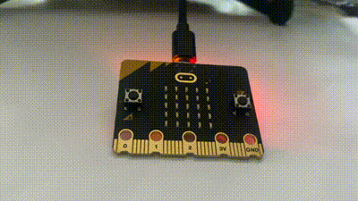
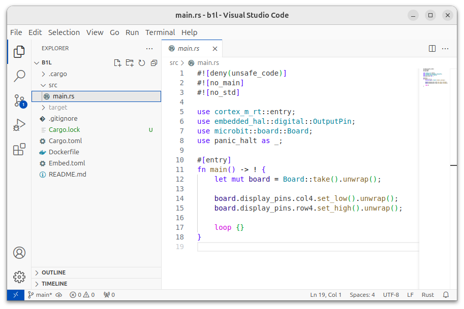
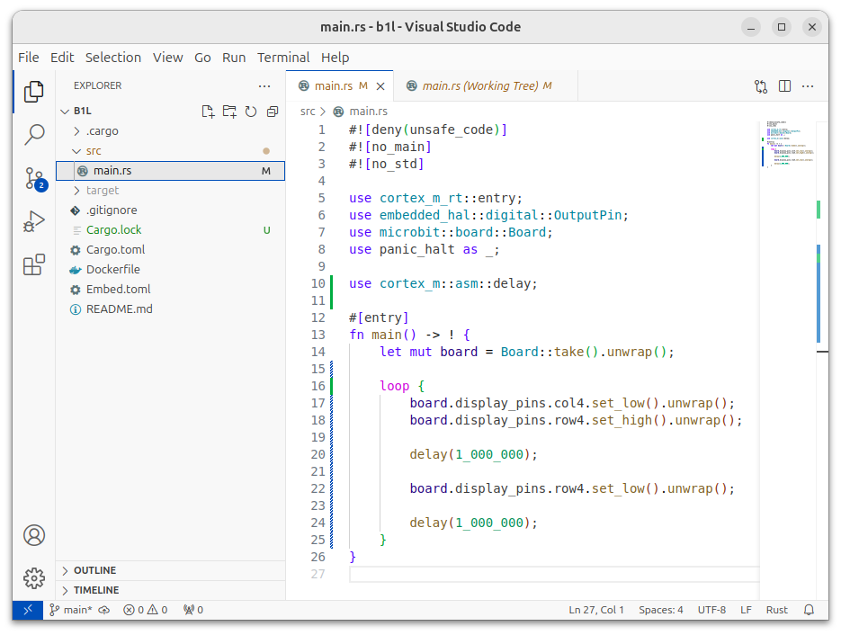
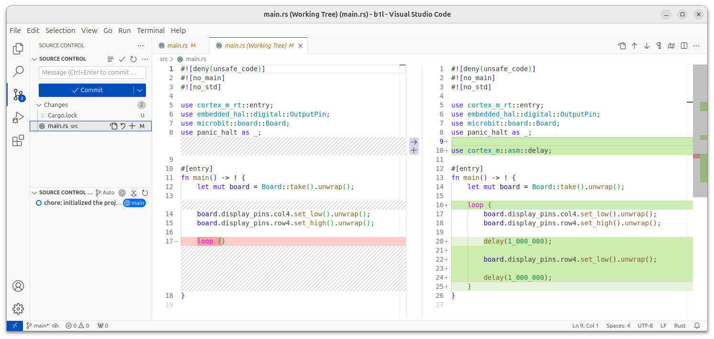
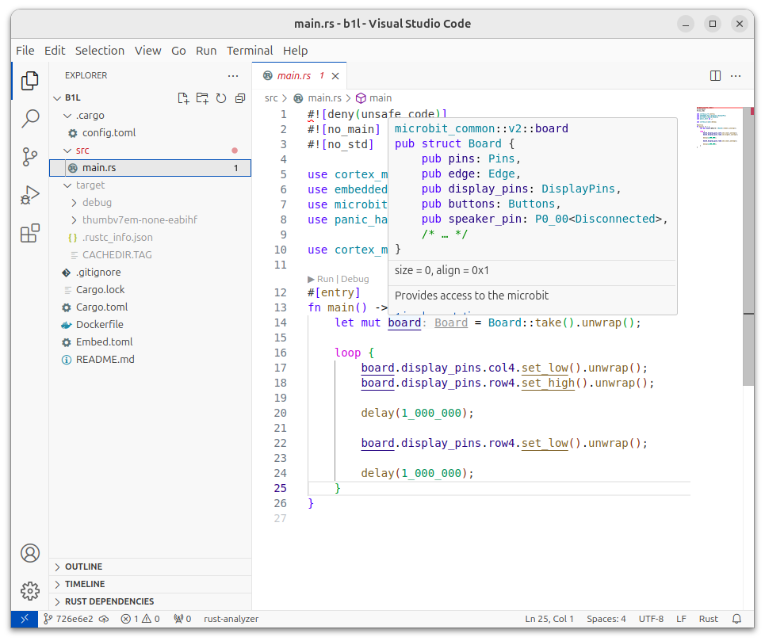
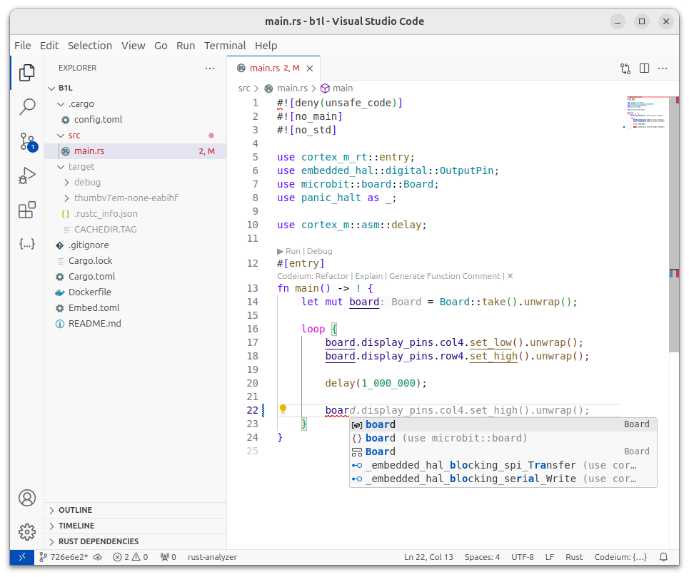
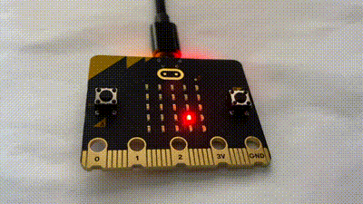
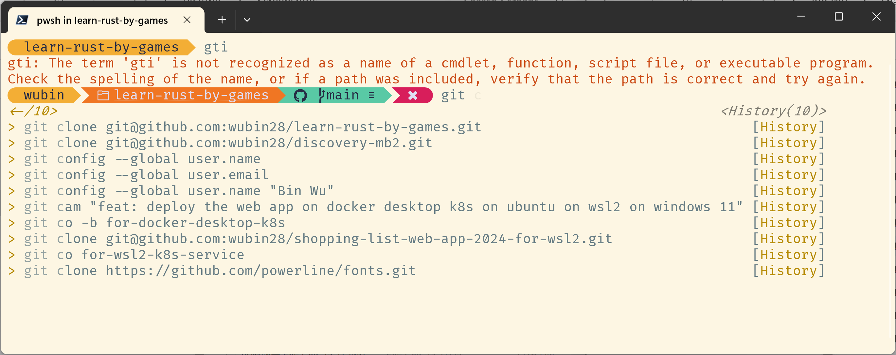
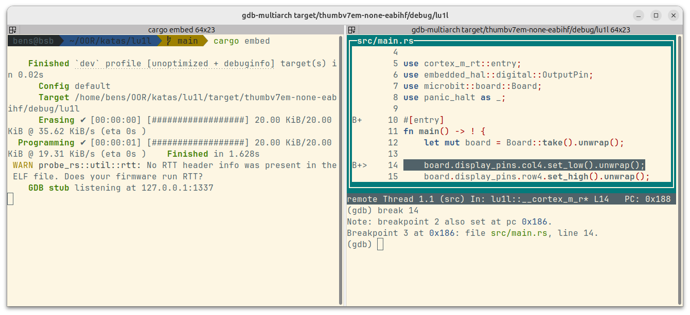

# Chapter 2: Making Your First LED Blink and Programming Supertools

As Confucius wisely noted 2,500 years ago: "To do a good job, one must first sharpen their tools." While he simply stated the outcome without explaining why, the reason is straightforward—just as in Chapter 1, where a beginner transformed from being indifferent about Typst to becoming an enthusiast—**user-friendly tools provide an excellent user experience**. In this chapter, we'll implement the embedded development community's version of "Hello, world!" to explore whether various programming tools can deliver that same outstanding experience.

What exactly is the embedded development community's "Hello, world!"? In this community, simply lighting up an LED isn't enough—making an LED continuously flash (blink) is considered the true "Hello, world!", as shown in Figure 2-1:



Figure 2-1 Making an LED continuously blink—the embedded development community's version of "Hello, world!"

# 2.1 Examining the AI-Generated Blinking Code

How do we transform our LED code from the previous chapter to make it blink instead of staying constantly lit? The key difference is that we need to add functionality for turning the LED off and introducing a delay. As before, let's start by generating the base LED code from our template:

```bash
cargo generate wubin28/mb2-led-template
# When the tool prompts for Project Name, you can enter b1l, meaning Blink 1st Led
# Enter this newly created project directory
cd b1l
```

But what if we're unsure how to implement the off state and delay functionality for the first time?

⚠️Writing unfamiliar code used to mean searching online, then copying, pasting, and modifying. Now, with AI assistants, the process is much simpler. Just ask the AI: "Please read code listing 1-6 and modify it to make the LED continuously blink. The changes should be simple and easy for programming beginners to understand." The AI will promptly provide the code you need.

## 2.1.1 Version Control with Git

⚠️How can we easily compare the AI-generated code and see exactly what changes were made? While creating two separate files and using a comparison tool might work, it's not the professional approach. For version control needs like this, Git is the ideal solution. When combined with the popular editor VS Code, reviewing code differences becomes effortless.

🔎Git acts as a time machine for code, letting programmers track and record every change. Whether you're coding solo or in a team, Git keeps everything organized.

Think of Git as a growing tree where each code version branches from previous changes. Developers get their own complete copy of the code with full history stored locally, eliminating the need for constant internet access. Since Git performs most operations locally, it's remarkably fast.

Git's crown jewel is its branching system. Create experimental branches to test new ideas, knowing you can always return to your original version. With each commit, Git records who made changes, when they occurred, and what was modified—like a detailed development diary. Through platforms like GitHub, teams can seamlessly share and collaborate.

Git's advantages are numerous: parallel development without interference, instant version rollbacks, offline work capability, and unique identifiers for each commit to ensure code security. Plus, it works flawlessly across Windows, Mac, and Linux.

Of course, Git has its learning curve. Newcomers need time to master its commands, and mistakes can lead to code mishaps. Managing multiple developers' simultaneous changes requires experience, and maximizing Git's potential often means learning complementary tools.

Yet Git proves invaluable across all development scenarios—from team projects to personal coding, from open source to learning exercises. While the initial learning phase may challenge you, mastering basic commands reveals Git as an indispensable ally. Start with the fundamentals and gradually explore its capabilities.

✅To preserve your LED light-up code for comparison with the AI-generated blinking version, install Git following the key points in Table 2-1:

Table 2-1 Key Points for Git Installation

| **Installing Git on Ubuntu 24** | **Installing Git on macOS** | **Installing Git on Windows 11** |
| --- | --- | --- |
| # Check git version (verify if installed)<br>`git --version`<br>`apt list --installed \| grep git`<br># Recommended: install git using apt<br>`sudo apt install git`<br># Reference page<br>https://git-scm.com/downloads/linux<br># Check latest available version<br>`apt show git \| grep Version`<br># Upgrade<br>`sudo apt update`<br>`sudo apt upgrade git` | # Check brew package manager version<br>`brew --version`<br># Install brew if not installed<br>`/bin/bash -c "$(curl -fsSLhttps://raw.githubusercontent.com/Homebrew/install/HEAD/install.sh)"`<br># Check git version (verify if installed)<br>`git --version`<br>`brew info git`<br># Recommended: install git using brew<br>`brew install git`<br># Reference page<br>https://git-scm.com/downloads/mac<br># Upgrade<br>`brew update`<br>`brew upgrade git` | # Check git version (verify if installed)<br>`git --version`<br>`winget list git`<br># Recommended: install git using winget<br>`winget install --id Git.Git -e --source winget`<br># Reference page<br>https://git-scm.com/downloads/win<br># Upgrade<br>`winget upgrade --id Git.Git` |

After installing Git, navigate to the b1l directory and run the following commands to check the repository status (note: `%` represents the zsh command prompt that distinguishes between commands and their output—you don't need to type it when entering commands):

```bash
# Display current Git repository status information
% git status
On branch main # Currently on main branch, where we'll do most of our programming

No commits yet # No commits have been made to the repository yet, meaning there's no history

Untracked files: # Lists all files and directories not yet tracked by Git.
                 # These files need to be explicitly added to Git's tracking list for version control
  # The line below explains how to add untracked files to the staging area, preparing them for commit
  (use "git add <file>..." to include in what will be committed)
	.cargo/
	.gitignore
	Cargo.toml
	Dockerfile
	Embed.toml
	README.md
	src/

# The line below indicates that no files have been added to the staging area yet, but untracked files exist.
# You can start tracking these files by running git add <file>
nothing added to commit but untracked files present (use "git add" to track)
```

Don't worry if the explanations above seem complex. What's important is that `cargo generate` has already set up the Git repository and created the necessary files for us. These files aren't being tracked by version control yet. To start tracking them, we'll follow two simple steps: first, use the `git add` command to place files in the staging area, then use the `git commit` command to save them permanently. The staging area is Git's intermediate workspace between your Working Directory **and** Repository—it's where you organize and prepare code changes before committing them.

Let's start by using the `git add .` command (remember the period at the end—it tells Git to include all files) to add files to the staging area, as shown below:

```bash
# Add all modified or new files in the current working directory to Git's staging area
% git add .
% git status
On branch main

No commits yet

Changes to be committed: # Shows changes that have been added to the staging area and will be included in the next commit
  # The line below explains how to use git rm --cached <file> to remove files from the staging area
  # (i.e., undo git add operation)
  (use "git rm --cached <file>..." to unstage)
	new file:   .cargo/config.toml # Lists all new files added to the staging area,
	                               # indicating they will be included in the next commit
	new file:   .gitignore
	new file:   Cargo.toml
	new file:   Dockerfile
	new file:   Embed.toml
	new file:   README.md
	new file:   src/main.rs
```

After running `git add .`, all files (including new and modified ones) are now in the staging area. These files are ready to commit using the `git commit -m "&lt;message&gt;"` command. When committing, you'll need to include a message that describes what was changed—this helps track modifications later. Once committed, these changes become permanently saved in Git's version history:

```bash
# Commit the contents of the staging area to the repository, recording it in history
# -m: specifies the commit message as "chore: initialized the project"
# chore is a common commit type used to indicate non-functional changes (like project initialization, configuration updates, etc.)
# While commit messages can be written in Chinese, practicing writing in English facilitates communication with international developers,
# Plus, writing English comments isn't difficult with AI translation assistance
% git commit -m "chore: initialized the project" 
# [main]: indicates the commit was made on the main branch
# (root-commit): indicates this is the repository's first commit (i.e., root commit)
# b7d4d95: the commit's unique hash value for tracking this commit
[main (root-commit) b7d4d95] chore: initialized the project
 # 7 files changed: a total of 7 files were changed or added
 # 326 insertions(+): added 326 lines in total
 7 files changed, 326 insertions(+)
 # create mode 100644: indicates these files were added
 # 100644 is the file permission flag, indicating a regular file where the owner has read-write permissions,
 # while group and other users only have read permissions
 create mode 100644 .cargo/config.toml
 create mode 100644 .gitignore
 create mode 100644 Cargo.toml
 create mode 100644 Dockerfile
 create mode 100644 Embed.toml
 create mode 100644 README.md
 create mode 100644 src/main.rs
```

**Git Commit Message Prefixes**

🔎Why do professional programmers use prefixes like "chore:" in their git commit messages?

Professional programmers use standardized prefixes like "chore:" to categorize their code changes. While these maintenance changes may not affect the application's functionality directly, they are essential for the project's health and maintainability. This convention helps team members quickly grasp each commit's purpose at a glance.

Common Git commit message prefixes include:

- **feat**: Add new features
- **fix**: Fix bugs
- **docs**: Update documentation
- **style**: Adjust code formatting (no logic changes)
- **refactor**: Improve code structure (no new features or fixes)
- **test**: Add or modify tests
- **chore**: Update build processes or tools

Using this commit message convention enhances code readability and streamlines team collaboration.

When you run the git status command again to check the repository status, you'll see these changes:

```bash
% git status
On branch main
# nothing to commit: there are no changes in the staging area that need to be committed
# This means all modifications in the working directory have been committed, or there are no untracked changes in either the staging area or working directory                                    
# working tree clean:
# The working directory is clean, with no untracked or uncommitted files
# File status hasn't changed (no new, modified, or deleted files)
nothing to commit, working tree clean
```

And we can see that previous commit through the following command:

```bash
% git log --oneline
# Opens a character interface showing the hash value and commit message of the last commit
b7d4d95 (HEAD -> main) chore: initialized the project
(END)
# Press q to exit
```

This shows that the original LED lighting code is now saved in Git repository commit b7d4d95. After we implement AI's suggested changes, VS Code will let us easily compare the differences between versions.

## 2.1.2 Viewing the Original LED Lighting Code in VS Code

VS Code is Microsoft's popular code editor that's free, open-source, and runs on Windows, macOS, and Linux. As a development tool, it offers powerful editing and debugging capabilities.

VS Code stands out for its speed and efficiency—it's lightweight yet feature-rich. Its cross-platform nature ensures a consistent development environment across systems, while its extensive plugin marketplace meets virtually every development need.

The editor comes with essential built-in features: intelligent code completion, syntax highlighting, Git version control, debugging tools, and an integrated terminal. Developers can customize their workspace through JSON configuration files and plugins.

VS Code's greatest strength is its balance of simplicity and power. Its open-source nature and vibrant community drive continuous improvement. Through plugins, it supports any programming language. While not as feature-complete as specialized IDEs, it provides all core development tools. Microsoft's regular updates keep it technologically advanced.

However, VS Code does have limitations. Many advanced features require plugin installation, which can complicate setup. Too many plugins may impact performance. New users need time to adjust, and large-scale projects might benefit more from dedicated IDEs like JetBrains products.

VS Code excels in specific scenarios. It's perfect for small to medium-sized projects, whether personal or open-source. Web developers benefit from excellent HTML, CSS, and JavaScript support. Its multi-language capabilities suit full-stack development, while cross-platform compatibility helps developers work across different systems. Notably, it shines in embedded development—for example, through Rust's embedded plugin. Its free, feature-rich nature makes it an ideal learning tool.

VS Code's combination of lightweight design, extensibility, and comprehensive features makes it especially valuable for developers needing a flexible environment. However, projects requiring specialized language support or extensive project management might need additional professional IDE support.

✅To edit and compare the AI-generated LED blinking code with the previous LED lighting code, please install VS Code according to the key points shown in Table 2-2:

Table 2-2 Key Points for VS Code Installation

| **Installing VS Code on Ubuntu 24** | **Installing VS Code on macOS** | **Installing VS Code on Windows 11** |
| --- | --- | --- |
| # Check if VS Code is installed: Press window key → search "code"<br># First download then use apt to install the VS Code .deb package<br># Reference webpage<br>https://code.visualstudio.com/download<br>`sudo apt install code_xxx_amd64.deb`<br># Verify installation<br>`code ./`<br># Check VS Code version<br>`code --version`<br># Check latest available version<br>`apt show code \| grep Version`<br># Upgrade<br>`sudo apt update`<br>`sudo apt upgrade code` | # Check if VS Code is installed: Press spotlight shortcut → search "code"<br># First download then unzip and drag the unzipped VS Code .app file into Applications folder<br># Reference webpage<br>https://code.visualstudio.com/download<br># Verify installation<br>`code ./`<br># Check VS Code version<br>`code --version`<br># Upgrade: Click Code in the top left corner, then select Check for Updates... | # Check if VS Code is installed: Press window key → search "code"<br># First download then double click the .exe installer<br># Reference webpage<br>https://code.visualstudio.com/download<br># Verify installation<br>`code ./`<br># Check VS Code version<br>`code --version`<br># Upgrade: Click three horizontal lines icon in top left → Help → Check for updates... |

After installing VS Code, we can enter the following command in the b1l directory to open the previous LED lighting code with VS Code:

```bash
# Enter the following command in Ubuntu terminal
# code ./: opens the contents of the current directory (./) using Visual Studio Code editor
# > /dev/null: redirects the command's standard output (stdout) to /dev/null,
#             effectively discarding the output to prevent it from showing in the terminal
# 1>&2: redirects standard output (1) to standard error output (2)
#       since standard output was previously directed to /dev/null, it is effectively discarded
# &: runs the command in the background, so the terminal isn't blocked and can continue accepting other commands
% code ./ > /dev/null 1>&2 &

# Enter the following command in macOS terminal
% code ./

# Enter the following command in Windows 11 cmd
> code .\
```

Then select the src/main.rs file in VS Code's left project file tree to view it, as shown in Figure 2-2:



Figure 2-2 Select the src/main.rs file in VS Code's left project file tree

## 2.1.3 Review the Changes in AI-Generated Code

Previously, we had AI generate blinking LED code based on the LED lighting code. Now let's copy the AI-generated code and replace the original code in [main.rs](http://main.rs), as shown in Figure 2-3:



Figure 2-3 Copy the AI-generated code and replace the original code in [main.rs](http://main.rs)

**Using git diff to examine code changes**

✅What differences appear in Figure 2-3 compared to Figure 2-2? While VS Code already highlights changes with vertical lines next to the line numbers, running the following command provides an even more detailed comparison:

```bash
# Display unstaged changes in the current working directory (changes not yet `git add`ed)
% git diff
diff --git a/src/main.rs b/src/main.rs
index c5d9f4c..5379e3f 100644
# Represents the file names before (-) and after (+) changes
--- a/src/main.rs
+++ b/src/main.rs
# Indicates the location of changes: starting from line 7, 12 lines before changes, 20 lines after changes
@@ -7,12 +7,20 @@ use embedded_hal::digital::OutputPin;
 use microbit::board::Board;
 use panic_halt as _;

# Lines beginning with plus (+) indicate newly added lines
+use cortex_m::asm::delay;
+
 #[entry]
 fn main() -> ! {
     let mut board = Board::take().unwrap();
# Lines beginning with minus (-) indicate removed lines
-
-    board.display_pins.col4.set_low().unwrap();
-    board.display_pins.row4.set_high().unwrap();
-
-    loop {}
+    
+    loop {
+        board.display_pins.col4.set_low().unwrap();
+        board.display_pins.row4.set_high().unwrap();
+        
+        delay(1_000_000);
+        
+        board.display_pins.row4.set_low().unwrap();
+        
+        delay(1_000_000);
+    }
 }
(END)
```

While `git diff` excels at showing changed lines and their immediate context (a few unchanged lines before and after), it can't simultaneously display both the changes and the complete code file. For instance, the above `git diff` command didn't reveal the full contents of [main.rs](http://main.rs). So how can we view both the changes and the complete code at once?

**Using VS Code to view changes in the complete code**

✅Here's an elegant solution that gives us both: In VS Code, click the branch icon (marked with the number 2) on the left side of Figure 2-3 (indicating two changed files), open the code changes tree, then select the [main.rs](http://main.rs) file. The right window will then display both the differences between the AI-provided code and the previous commit version, alongside the complete source file content, as shown in Figure 2-4:



Figure 2-4 Viewing the differences between AI-generated code and previously committed code in VS Code

✅Now, modify your [main.rs](http://main.rs) source code to match the AI-generated code shown on the right side of Figure 2-4. Once you've made these changes, we'll examine the code in detail.

**Using the rust-analyzer plugin to automatically display variable types**

🔎When writing code, have you wondered about the specific type of the `board` variable after type inference in `let mut board = Board::take().unwrap();`? While Figure 2-3 doesn't show this directly, there's a powerful tool that reveals it—VS Code's rust-analyzer plugin, as shown in Figure 2-5:



Figure 2-5 With rust-analyzer installed, you can view variable types directly in the code and see documentation by hovering over them

rust-analyzer is Rust's official VS Code extension that provides intelligent code analysis and assistance. It serves as a powerful coding companion for developers.

The plugin offers essential features including real-time code completion, syntax highlighting, go-to-definition functionality, instant error detection with fix suggestions, code refactoring tools (like renaming and function extraction), macro expansion viewing, and inline documentation. Its lightweight design ensures smooth performance with minimal system impact.

As Rust's official tool, rust-analyzer seamlessly integrates with the Rust ecosystem. Written in Rust itself, it delivers IDE-grade development features while maintaining high performance. Beginners will appreciate its straightforward setup process after installing the Rust toolchain. The plugin also benefits from an engaged developer community that provides swift support.

However, it does have limitations. Its project navigation and debugging features aren't as robust as full IDEs. Complex macro handling can be imperfect, and larger projects may experience occasional slowdowns. The tool also requires proper Rust toolchain setup to work optimally.

Despite these constraints, rust-analyzer stands out as the go-to choice for most developers. It effectively supports both solo development and team projects, while being particularly helpful for Rust newcomers through its code completion and diagnostic tools. For small to medium-sized projects, it streamlines the coding and debugging process. Combined with VS Code, it creates an efficient yet powerful development setup.

For both VS Code-based Rust development and Rust learning, rust-analyzer proves indispensable. It enhances both coding productivity and output quality.

✅To install rust-analyzer, click the Extensions icon (four squares) in VS Code's left toolbar, open the Extensions Marketplace, and search for "rust-analyzer" to install.

**Use VS Code's Codeium Plugin for AI-Powered Code Completion Suggestions**

🔎With AI-assisted programming becoming mainstream, wouldn't you like to receive smart coding suggestions in real time? By typing just a few characters, you can get AI-powered code completion recommendations. If this interests you, try VS Code's free Codeium plugin, shown in Figure 2-6:



Figure 2-6 With VS Code's Codeium plugin installed, typing just a few characters like `boar` triggers AI-powered code completion suggestions

Codeium is a powerful AI programming assistant that revolutionizes the development experience. It supports multiple programming languages—including Rust, Python, and JavaScript—while boosting productivity through intelligent code completion and natural language suggestions.

In practice, Codeium's features shine. Its AI completion system understands context and generates complete functions based on developer intent. The multi-language support streamlines cross-language development, while natural language coding makes programming more intuitive. It learns from your coding style and can generate commonly used snippets.

For developers, Codeium offers clear benefits. It speeds up programming, especially during rapid prototyping. Beginners gain a patient mentor through its intelligent suggestions for syntax and best practices. The multi-language support proves invaluable for cross-language projects. Most importantly, it lowers barriers to entry—developers can generate basic code using natural language descriptions. All core features are free for individual developers.

However, Codeium has limitations. It sometimes struggles with complex Rust code contexts. Being AI-driven, it needs substantial computing power and an internet connection. Generated code may require optimization, and users should consider privacy when processing code.

Despite these constraints, Codeium proves valuable across many use cases. It accelerates prototyping and helps newcomers grasp programming concepts. Its multi-language capabilities particularly benefit cross-language projects. By reducing repetitive tasks and streamlining development, it boosts overall productivity.

Codeium stands out as an excellent AI programming assistant, especially for Rust developers, cross-language programmers, and beginners. While complex projects and privacy-sensitive work require careful consideration, it excels in daily development and learning tasks.

✅To install the Codeium plugin, click the Extensions icon in VS Code's left toolbar, open the Extensions Marketplace, then search for and install "codeium".

# 2.2 Compile, Run and Commit

✅Before we analyze the AI-generated code in detail, let's run these commands in the b1l directory to compile and test the code:

```bash
% cargo run
   Compiling semver-parser v0.7.0
   (other lines omitted)
   Compiling b1l v0.1.0 (/home/bens/temp/b1l)
    Finished `dev` profile [unoptimized + debuginfo] target(s) in 19.28s
     Running `probe-rs run --chip nRF52833_xxAA target/thumbv7em-none-eabihf/debug/b1l`
 WARN probe_rs::util::rtt: No RTT header info was present in the ELF file. Does your firmware run RTT?
      Erasing ✔ [00:00:00] [############################] 20.00 KiB/20.00 KiB @ 35.44 KiB/s (eta 0s )
  Programming ✔ [00:00:01] [############################] 20.00 KiB/20.00 KiB @ 19.39 KiB/s (eta 0s )    Finished in 1.626s
```

Since we installed the target platform and probe-rs flashing tool in the previous chapter, we can now directly run the cargo run command (which includes the cargo build functionality) smoothly. After a brief moment when the LED in row 4, column 4 of the development board turns off (this is because probe-rs needs to erase the original program on the board before flashing), it begins to blink rapidly, as shown in Figure 2-7:



Figure 2-7 The AI-generated code successfully made the LED at row 4, column 4 of the development board flash rapidly

✅With the code working correctly, let's run the following `%`-prefixed commands to commit our changes, which will make future code comparisons easier:

```bash
# Press Ctrl+C to terminate the program and return to the command prompt
% git status
On branch main
Changes not staged for commit:
  (use "git add &lt;file&gt;..." to update what will be committed)
  (use "git restore &lt;file&gt;..." to discard changes in working directory)
	modified:   src/main.rs # main.rs contains AI's blinking code

Untracked files:
  (use "git add &lt;file&gt;..." to include in what will be committed)
	Cargo.lock # Since this is an application, the auto-generated Cargo.lock needs to be committed to maintain dependency stability

no changes added to commit (use "git add" and/or "git commit -a")
% git add .
% git status
On branch main
Changes to be committed:
  (use "git restore --staged &lt;file&gt;..." to unstage)
	new file:   Cargo.lock
	modified:   src/main.rs
# Format source code according to community-standard Rust style, including code indentation, spacing, line breaks, etc.,
# to ensure consistent code style across the project and avoid conflicts due to formatting differences between developers,
% cargo fmt
% git commit -m "feat: blinked the LED using cortex_m::asm::delay"
[main 726e6e2] feat: blinked the LED using cortex_m::asm::delay
 2 files changed, 438 insertions(+), 5 deletions(-)
 create mode 100644 Cargo.lock
% git log --oneline
726e6e2 (HEAD -&gt; main) feat: blinked the LED using cortex_m::asm::delay
b7d4d95 chore: initialized the project
```

# 2.3 Understanding the AI-Provided Blinking Code

Now let's examine the key components of the AI-provided blinking code through detailed code comments, as shown in Code Listing 2-1:

Code Listing 2-1 ch02/b1l/src/main.rs Using the processor's idle-loop cortex_m::asm::delay() function to implement timing delays

```rust
#![deny(unsafe_code)]
#![no_main]
#![no_std]

use cortex_m_rt::entry;
use embedded_hal::digital::OutputPin;
use microbit::board::Board;
use panic_halt as _;

// Import the delay function for implementing time delays in the program
use cortex_m::asm::delay;

#[entry]
fn main() -> ! {
    let mut board = Board::take().unwrap();
    
    loop {
        board.display_pins.col4.set_low().unwrap();
        board.display_pins.row4.set_high().unwrap();
        
        // delay() is a function that implements delay using processor internal loops,
        // the parameter value represents the number of loops the processor should execute, equivalent to about 1/16 second
        delay(1_000_000);
        
        // Set row 4 to low level to turn off this LED
        board.display_pins.row4.set_low().unwrap();
        
        // Delay again for about 1/16 second
        delay(1_000_000);
    }
}
```

🔎Let's explore how the `delay(1_000_000)` function works. Think of it as a programmed pause—when executed, the processor idles in place, consuming power without doing useful work.

The processor on our development board is quite powerful, executing 64 million basic operations per second. During the delay, it performs 4 million basic operations (1 million cycles × 4 operations per cycle). At this speed, the pause lasts approximately 0.0625 seconds (1/16 second).

Since the LED blinking program requires one pause for each ON and OFF state, a complete blink cycle takes about 1/8 second—explaining the rapid flashing. To adjust the blinking speed, simply modify the delay value: 16,000,000 for a 1-second pause, 8,000,000 for half a second, or 1,600,000 for a quick 0.1-second blink.

# 2.4 Improving the AI-Generated Blinking Code

⚠️The `cortex_m::asm::delay()` method in Code Listing 2-1 has two key drawbacks: it wastes power by keeping the processor running through empty loops, and it provides imprecise timing. For better accuracy, we should leverage the development board's dedicated hardware timers. But how do we use them?

When in doubt, ask AI. Let's show AI our question along with Code Listing 2-1 and see how it improves the code, as demonstrated in Code Listing 2-2:

Code Listing 2-2 ch02/b1l/examples/b1lut0.rs Using the mb2 development board's dedicated hardware timer TIMER0 peripheral for delay implementation

```rust
#![deny(unsafe_code)]
#![no_main]
#![no_std]

use cortex_m_rt::entry;
use embedded_hal::digital::OutputPin;
// Import the DelayNs trait for delay functionality
use embedded_hal::delay::DelayNs;
use microbit::board::Board;
// Import the development board's dedicated hardware timer functionality
use microbit::hal::timer::Timer;
use panic_halt as _;

#[entry]
fn main() -> ! {
    let mut board = Board::take().unwrap();

    // Initialize hardware timer TIMER0
    let mut timer = Timer::new(board.TIMER0);

    loop {
        board.display_pins.col4.set_low().unwrap();
        board.display_pins.row4.set_high().unwrap();

        // Delay for 500 milliseconds
        timer.delay_ms(500_u32);

        board.display_pins.row4.set_low().unwrap();

        // Delay for another 500 milliseconds
        timer.delay_ms(500_u32);
    }
}
```

🔎Rather than typing out Code Listing 2-2 manually, you can run the pre-written code from this book's repository. Just execute the following command in the ch01/b1l directory:

```bash
# b1lut0 stands for Blink the 1st Led Using Timer0
cargo run --example b1lut0
```

🔎Hardware timers work in a straightforward way: you set a target value and start the timer counting. During counting, the processor can save power by entering sleep mode instead of staying active. Once the timer hits its target value, it sends an interrupt signal to wake up the processor.

This elegant design offers three key benefits: the processor saves energy by sleeping during timing operations; dedicated hardware counters provide much better timing precision than software methods; and most importantly, the processor stays free to handle other tasks instead of being tied up with timing duties—perfect for multitasking scenarios.

✅After modifying the code, run the following commands to format, compile, run, and commit the code (similar steps will not be repeated in future explanations).

```bash
% cargo fmt
% cargo clean
% cargo run
# Press Ctrl+C to exit the loop program
% git status
% git diff
# Press q to exit git diff interface
% git add .
% git status
% git commit -m "feat: blinked the LED using microbit::hal::timer::Timer"
% git log --oneline
# Press q to exit git log interface
```

⚠️Typing commands one by one in the terminal can be tedious. Even with keyboard shortcuts like up/down arrows, the `history` command (in Ubuntu/macOS and Windows 11's PowerShell 7+), or `Ctrl+R` for history search, the process remains cumbersome. Could there be a better command-line tool to streamline this?

# 2.5 The Ultimate Tool for Easy Terminal Command Input

🔎Looking to simplify your command-line work? This powerful tool lets you use shortcuts like `gst` for `git status` and `ga .` for `git add .`. It displays real-time git repository status and offers intelligent command completion.

The tool learns from your command history to make smart suggestions. As you type, it displays your previously used commands in light gray. Simply press the right arrow key or `Ctrl+E` to accept a suggestion, making command entry quick and effortless.

Better yet, it uses color coding to guide you: green for correct commands, red for errors. File paths get their own distinct colors, making it easy to spot command mistakes at a glance.

The tool also features robust command completion, offering intelligent suggestions for a wide range of commands and parameters, creating a smoother, more intuitive command-line experience. Take a look at Figures 2-8 and 2-9:


Figure 2-8 On Ubuntu and macOS, Oh My Zsh marks incorrect commands like `gti` with a red cross, and automatically displays historical command suggestions in gray text after the user types `git c`



Figure 2-9 On Windows 11, Oh My Posh marks incorrect commands like `gti` with a red cross and shows historical command suggestions in gray text after typing `git c`

Intriguing, isn't it? These powerful tools—Oh My Zsh (for Linux and macOS) and Oh My Posh (for Windows)—along with their plugins transform your terminal experience.

## 2.5.1 Enhancing Terminal Experience with Oh My Zsh and Oh My Posh

🔎For Linux and macOS users, Oh My Zsh is an invaluable assistant. This open-source Zsh configuration framework streamlines command-line operations while boosting productivity. Its rich plugin system and theme configurations create a terminal that's both powerful and visually appealing.

Oh My Zsh shines in its practicality. It comes with a wealth of plugins for git, docker, and more, offering smart command completion and handy aliases. Looking to personalize? Choose from over 150 themes to customize your terminal's appearance. Beginners will appreciate its user-friendly automated setup and updates. Best of all, an active community keeps developing new features and plugins.

With Oh My Zsh, your daily command-line tasks become smooth and natural. Its plugin ecosystem handles everything from development to version control, with adjustable features to match your workflow. Keep in mind though—too many plugins can slow down your terminal's startup, and mastering the various configurations takes time.

Windows users will find their perfect match in Oh My Posh. This purpose-built terminal customization tool works seamlessly with PowerShell and Windows Terminal, focusing on beautiful aesthetics and status displays.

Oh My Posh features diverse themes you can switch between instantly. It integrates perfectly with Windows terminal emulators and shells, providing real-time Git repository status and branch information. As a lightweight solution, it delivers core features without burdening your system.

Oh My Posh excels in creating a beautiful, clear terminal interface with straightforward configuration and minimal resource usage. Its main limitation is its focus on appearance—it offers fewer command-line improvements and plugins compared to Oh My Zsh. Still, for Windows users seeking a more attractive terminal and simpler Git operations, Oh My Posh is the way to go.

🧠 What shortcut commands do Oh My Zsh on Linux and macOS and Oh My Posh on Windows configuration frameworks provide for Git operations?

## **2.5.2 Base Platforms zsh or PowerShell 7+**

Before diving into these powerful tools, you'll need their foundations—zsh for Linux and macOS users, or PowerShell 7+ for Windows users (version 7 or higher). Follow the installation key points in Table 2-3:

Table 2-3 Key Points for Installing zsh or PowerShell 7+

| **Installing zsh on Ubuntu 24** | **Installing zsh on macOS** | **Installing PowerShell 7+ on Windows 11** |
| --- | --- | --- |
| # Check zsh version (verify if installed)<br>`zsh --version`<br>`apt list --installed \| grep zsh`<br># Recommended: install zsh using apt<br>`apt install zsh`<br># Reference webpage<br>https://github.com/ohmyzsh/ohmyzsh/wiki/Installing-ZSH<br># Set zsh as default shell and re-login<br>`chsh -s $(which zsh)`<br># Verify successful installation<br>`echo $SHELL`<br># Check latest available version<br>`apt show zsh \| grep Version`<br># Upgrade<br>`sudo apt update`<br>`sudo apt upgrade zsh` | # Check zsh version (verify if installed)<br>`zsh --version`<br>`brew info zsh`<br># Recommended: install zsh using brew<br>`brew install zsh`<br># Reference webpage<br>https://github.com/ohmyzsh/ohmyzsh/wiki/Installing-ZSH<br># Verify successful installation<br>`echo $SHELL`<br># Upgrade<br>`brew update`<br>`brew upgrade zsh` | # Install PowerShell 7+ to replace system's 5.1<br># Check PowerShell version (verify if installed)<br>`winget list Microsoft.PowerShell`<br># Recommended: install git using winget<br>`winget install --id Microsoft.Powershell --source winget`<br># Reference webpage<br>https://learn.microsoft.com/en-us/powershell/scripting/install/installing-powershell-on-windows?view=powershell-7.4<br># Upgrade<br>`winget upgrade --id Microsoft.Powershell` |

🔎Zsh (Z Shell) is a powerful Unix shell and command interpreter that builds on Bash's capabilities while adding innovative features. It offers a friendly, highly customizable command-line environment for both macOS and Linux systems.

Zsh shines with its intelligent features, particularly its robust auto-completion for commands, filenames, and paths—making programming smoother and more efficient. Script writers benefit from its full Bash compatibility while gaining access to more flexible options. Through Oh My Zsh, users can easily customize their terminal with themes and plugins for both functionality and aesthetics.

In daily use, Zsh's thoughtful design shows in every detail. The prompt displays helpful Git and system status information, while its intuitive command history search helps you quickly find previous commands. It maintains a consistent experience across macOS and Linux, with powerful file matching that handles complex directory structures with ease.

Key advantages of Zsh include practical built-in features like shared and inline history completion, a rich plugin ecosystem through Oh My Zsh or Prezto, smart completion and shortcuts, active community support, extensive customization options, and seamless Git integration.

However, Zsh does have some limitations. New users need time to learn its features, and too many plugins can slow startup times. Some Bash scripts may need adjustments for compatibility, plugin-dependent features can cause issues, and certain Linux distributions require manual setup.

Zsh particularly suits software developers and system administrators seeking higher productivity, users who value customization, those working across different systems, advanced shell script writers, and Git users who appreciate native support.

Think of Zsh as your capable command-line assistant. While it requires initial learning, mastering it doubles your terminal productivity. It delivers on both efficiency and user experience.

🔎PowerShell comes in two key versions: PowerShell 5.1 and PowerShell 7+. PowerShell 5.1, built on .NET Framework, comes pre-installed with Windows 11. PowerShell 7+, built on .NET Core (now .NET 5+), works across Windows, Linux, and macOS as a modern, versatile tool.

PowerShell 5.1 excels as a Windows specialist, featuring a comprehensive module library for managing Windows system APIs, services, registry, and file system. However, it operates exclusively on Windows.

PowerShell 7+ operates across platforms and introduces advanced features like pipeline chain operators and parallel processing. It handles errors more intelligently and performs better overall. While it runs most PowerShell 5.1 modules, some compatibility issues may arise.

Each version has its strengths: PowerShell 5.1 offers rich community resources and works immediately on Windows, while PowerShell 7+ provides cross-platform support, better performance, and regular feature updates.

Each also has limitations. PowerShell 5.1 works only on Windows and no longer receives updates. PowerShell 7+, while more modern, requires separate installation, may face compatibility issues, and has a learning curve for its new features.

Choose PowerShell 5.1 if you primarily use Windows and rely on traditional Windows tools and scripts. Opt for PowerShell 7+ if you need cross-platform support or want a modern development experience, especially for DevOps and cloud computing. For new projects, we recommend PowerShell 7+ as the forward-looking choice.

## **2.5.3 Modern Terminals with Split-Screen Capability and Beautiful Interfaces**

✅After installing zsh or PowerShell 7+ (Windows users: run all subsequent terminal commands in PowerShell 7+), you can enhance your experience with a modern terminal offering split-screen functionality and improved aesthetics.

Specific recommendations are as follows (old terminal → new terminal):

- Ubuntu: GNOME Terminal → Terminator
- macOS: Terminal → iTerm2
- Windows 11: CMD → Windows Terminal

While the old terminals lack split-screen support, the new ones all include this feature. We'll use these modern terminals for all subsequent commands.

For example, when debugging a mb2 board in Ubuntu's Terminator, pressing `Ctrl+Shift+E` splits the screen: the left side runs `cargo embed` for debugging connections, while the right handles breakpoints, program stepping, and variable monitoring. You can further divide each section as needed—far more efficient than managing multiple separate windows, as shown in Figure 2-10:



Figure 2-10 Using split-screen in Ubuntu's Terminator to debug the mb2 board with gdb

🔎Ubuntu offers two primary terminals: the default GNOME Terminal and the feature-rich Terminator. GNOME Terminal is Ubuntu's native terminal emulator—a reliable, lightweight, and user-friendly tool that handles everyday command-line tasks. Terminator, designed for advanced users and developers, excels at managing complex operations.

GNOME Terminal shines in its simplicity and practicality. Like a compact Swiss Army knife, it delivers essential functions without excess. It starts instantly, uses minimal resources, and lets you customize fonts and colors. Its gentle learning curve makes it perfect for Linux beginners.

Terminator functions like a deluxe Swiss Army knife. Its standout feature—window splitting—lets you manage multiple terminals in one interface. With rich shortcut options, plugin support, and the ability to broadcast commands to multiple terminals at once, it makes complex development tasks feel effortless.

Each tool has distinct strengths. GNOME Terminal offers simplicity, seamless system integration, and minimal resource usage. Terminator provides more power but demands more system resources and time to master.

Which should you choose? For Linux newcomers or basic command-line work, GNOME Terminal is ideal. But for developers and system administrators juggling multiple tasks, especially on large screens, Terminator boosts productivity significantly. Its split-screen and command broadcasting features prove invaluable when debugging code, managing servers, or collaborating with teams.

🔎macOS features two main terminals: the built-in Terminal and the powerful iTerm2. Terminal serves as a skilled specialist, handling basic command-line tasks reliably, while iTerm2 acts as a versatile all-rounder, offering advanced features for developers and power users.

Terminal, macOS's native option, excels through its lightweight design and seamless system integration. It offers basic font and color customization plus simple shortcuts. Its intuitive, ready-to-use nature makes it many users' preferred choice.

iTerm2 delivers a richer experience. It enables multiple terminal sessions in one window for easy task switching. Beyond advanced tab management and theme customization, it includes screen recording for code demos and efficient batch operations through its broadcast feature.

Terminal's strengths lie in its lightweight build and stability—it's like a dependable companion that handles daily tasks without complex setup. iTerm2 enhances productivity through powerful split-screen features, extensive customization, and robust development tools. Its status indicators and command logging particularly help during debugging.

Both tools have limitations. Terminal struggles with complex tasks and offers limited customization. iTerm2, while powerful, requires learning time and uses more system resources.

For newcomers to command line or those needing basic operations, Terminal works perfectly. Developers handling complex tasks or wanting a highly customizable environment should choose iTerm2. It enhances both individual productivity and team collaboration.

While iTerm2 typically suits daily development best, Terminal remains valuable for simpler tasks where its lightweight nature shines. Your choice should reflect your specific needs and work style.

🔎Windows provides two key terminals: the classic CMD and the modern Windows Terminal.

CMD is Windows' trusted veteran. As the system's original terminal, it handles basic command-line tasks and excels with DOS-style commands. It's lightweight, simple, and highly compatible with legacy systems. However, its plain interface and basic features show its age against modern alternatives.

Windows Terminal stands as a modern powerhouse. It includes CMD's capabilities while offering a fresh experience. You can run multiple tools—CMD, PowerShell, or WSL—in different tabs within one window. Its polished interface features GPU acceleration, transparency options, and custom backgrounds.

Windows Terminal's capabilities run deep. It offers extensive customization through shortcuts, startup settings, and JSON configuration. Its split-screen and multi-session support prove essential for developers.

Both serve distinct purposes. CMD's lightweight nature suits simple tasks and low-resource systems, especially for legacy scripts and older system compatibility.

Windows Terminal thrives in modern development. It handles coding, debugging, and server management smoothly. Its robust multitasking and customization make it perfect for developers and power users, particularly in cross-platform development and WSL usage.

While Windows Terminal represents modern terminal evolution, CMD maintains its value in specific scenarios. Choose based on your needs and use cases.

🔎If you're interested in split-screen functionality, refer to Table 2-4 to learn about the split-screen shortcuts for these three modern terminals:

Table 2-4 Split-screen shortcuts for the three modern terminals

| Split-screen shortcuts | **Using Terminator on Ubuntu** | **Using iTerm2 on macOS** | **Using Windows Terminal on Windows** |
| --- | --- | --- | --- |
| Split right | Ctrl+Shift+E | Cmd+D | Alt+Shift++ |
| Split down | Ctrl+Shift+O | Shift+Cmd+D | Alt+Shift+- |
| Switch between panes | Ctrl+Shift+N or Ctrl+Tab | Cmd+Opt+arrow keys | Alt+arrow keys |
| Close current pane | Ctrl+Shift+W | Cmd+W | Ctrl+Shift+W |

Please refer to Table 2-5 for key installation points of the three modern terminals:

Table 2-5 Key installation points for modern terminals

| **Installing Terminator on Ubuntu 24** | **Installing iTerm2 on macOS** | **Installing Windows Terminal on Windows 11** |
| --- | --- | --- |
| # Press the window key and search for terminator to check if it's already installed<br># Install Terminator<br>`sudo apt update`<br>`sudo apt install terminator` | # Press the window key and search for iterm2 to check if it's already installed<br># Install iTerm2<br>`brew install --cask iterm2` | # Check Windows Terminal version: Bottom of screen "Search" → search "terminal" → click "terminal" → down arrow next to + at top of terminal → "About"<br># Recommended to download and install Windows Terminal from the web Microsoft Store<br># Reference webpage<br>https://learn.microsoft.com/en-us/windows/terminal/install<br># Verify successful installation: Bottom of screen "Search" → search "terminal" → click "terminal" |

## **2.5.4 Installing Oh My Zsh or Oh My Posh**

Once all the above preparations are complete, you can install the powerful Oh My Zsh or Oh My Posh tools following these installation points:

**Installing Oh My Zsh on Ubuntu 24**

```bash
# Check oh my zsh version (verify if already installed)
omz version
# Oh my zsh installation reference webpage
https://github.com/ohmyzsh/ohmyzsh/wiki
# Add 3 plugins in ~/.zshrc file: command history suggestions, real-time syntax highlighting, additional command completion
plugins=( ... zsh-autosuggestions zsh-syntax-highlighting zsh-completions)
# Install command history suggestions plugin
git clone https://github.com/zsh-users/zsh-autosuggestions ${ZSH_CUSTOM:-~/.oh-my-zsh/custom}/plugins/zsh-autosuggestions
# Install real-time syntax highlighting plugin
git clone https://github.com/zsh-users/zsh-syntax-highlighting.git ${ZSH_CUSTOM:-~/.oh-my-zsh/custom}/plugins/zsh-syntax-highlighting
# Install additional command completion plugin
git clone https://github.com/zsh-users/zsh-completions ${ZSH_CUSTOM:=~/.oh-my-zsh/custom}/plugins/zsh-completions
# Verify successful installation: Close and reopen terminal, git clone a repository, enter it, and check if main branch is visible
# Upgrade
omz update
# Install fonts to properly display special prompt symbols:
# Install DejaVu Sans Mono for Powerline font
sudo apt-get install fonts-powerline
# Or install Nerd Fonts
wget https://github.com/ryanoasis/nerd-fonts/releases/download/v3.1.1/JetBrainsMono.zip\\nunzip JetBrainsMono.zip -d ~/.local/share/fonts/\nfc-cache -fv
# Select font and theme for proper command prompt display
# Right-click anywhere inside Terminator → Preferences → Profiles → default → General → Font → JetBrainsMonoNL Nerd Font Propo Italic 12 → Colors → Built-in schemes → Solarized light
```

**Installing Oh My Zsh on macOS**

Same as above, but the final font and color scheme configuration is not necessary.

**Installing Oh My Posh on Windows 11**

```bash
# Check oh my posh version (verify if already installed)
oh-my-posh --version
# Recommended to install oh my posh using winget
winget install JanDeDobbeleer.OhMyPosh -s winget
# Reference webpage
https://github.com/ohmyzsh/ohmyzsh/wiki
# Upgrade
winget upgrade JanDeDobbeleer.OhMyPosh
# Edit PowerShell configuration file using notepad $PROFILE command, add the following configuration at the end:
Import-Module posh-git
Import-Module PSReadLine
Set-PSReadLineOption -PredictionSource History
Set-PSReadLineOption -PredictionViewStyle ListView
oh-my-posh init pwsh | Invoke-Expression
# Install FiraCode Nerd Font to properly display special prompt symbols:
# Create temporary directory
New-Item -ItemType Directory -Path "$env:TEMP\NerdFonts" -Force
# Download FiraCode Nerd Font
curl -LO https://github.com/ryanoasis/nerd-fonts/releases/download/v3.1.1/FiraCode.zip
# Move downloaded zip file to temporary directory
Move-Item .\FiraCode.zip "$env:TEMP\NerdFonts\FiraCode.zip"
# Extract font files
Expand-Archive -Path "$env:TEMP\NerdFonts\FiraCode.zip" -DestinationPath "$env:TEMP\NerdFonts\FiraCode" -Force
# Install fonts
$fonts = (New-Object -ComObject Shell.Application).Namespace(0x14)
Get-ChildItem "$env:TEMP\NerdFonts\FiraCode\*.ttf" | ForEach-Object { $fonts.CopyHere($_.FullName) }
# Clean up temporary files
Remove-Item "$env:TEMP\NerdFonts" -Recurse -Force
# Select font and color scheme to properly display command prompt
# Windows Terminal → Settings → Profiles → PowerShell → Appearance → Font → FiraCode Nerd Font → Color Scheme → Solarized Light
```

During the installation and configuration of these powerful programming tools, you might run into some challenges. When troubleshooting, be sure to provide your AI assistant with detailed information about your steps and environment to receive the most accurate solutions.

After mastering these user-friendly programming tools introduced in this chapter, you'll find your programming journey both more efficient and enjoyable.