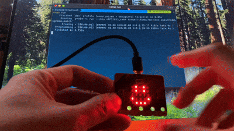
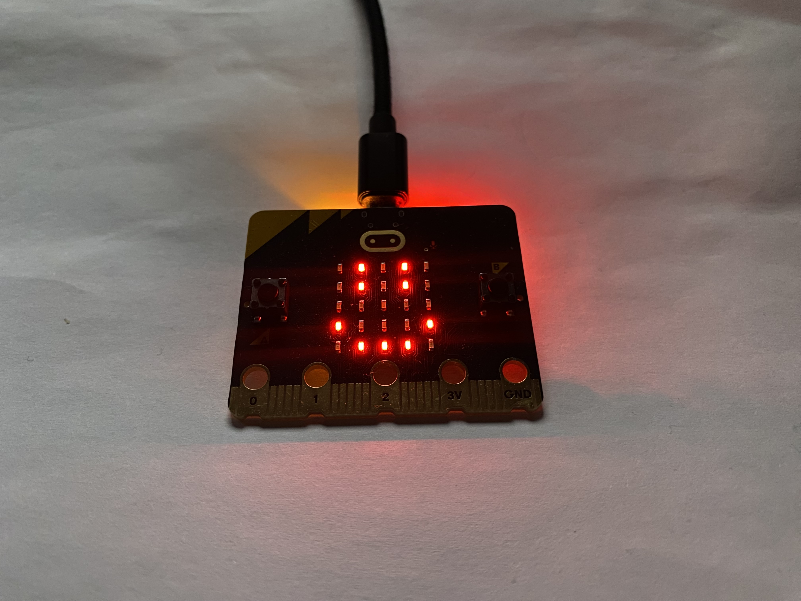
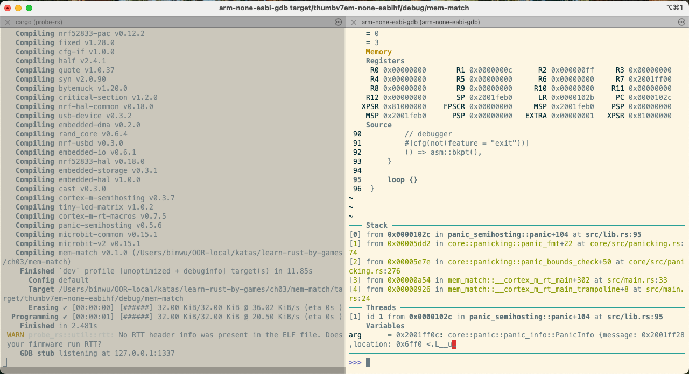
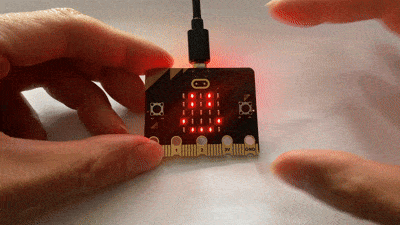
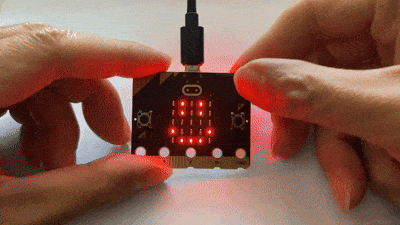
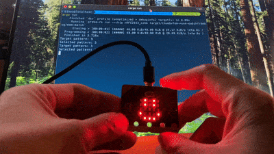

# Chapter 3: Memory Challenge Game and Variables

To keep rusty_rookie engaged while learning Rust instead of getting bored with dry materials, creating games is the best approach. Starting from this chapter, I will work with rusty_rookie to develop a series of games using Rust. We'll explore relevant Rust concepts as we implement each game's functionality, making the learning process more enjoyable.

In this chapter, we will create a game called "Memory Challenge." Before we start coding, let's understand the game rules.

# 3.1 How to Play the Memory Challenge Game

The Memory Challenge game exercises memory and hand-eye coordination. Let me briefly introduce the gameplay. Why not explain all the details upfront? For both beginners and professional programmers, implementing a new game means dealing with unfamiliar aspects that are difficult to plan clearly from the start. The development path often becomes clear only after encountering some setbacks. But don't worry—we'll use a **small-step iterative** approach to implement this game gradually. This approach lets us clarify our thinking during development and make improvements along the way. Although the GIF animation you'll see next was recorded after completing the game (you'll notice I press button B, which wasn't initially planned), I'll preserve the thought process from the initial exploration to let you **truly experience the journey of software development**.

Before the game starts, the LED matrix displays a fixed smiley face to welcome the player.

Once ready, the matrix randomly displays a target pattern for the player to memorize. The player presses button A on the left to confirm they have memorized the pattern. Afterward, the matrix displays a new random pattern every second. The player must determine whether the current pattern matches the initial target pattern. If they think it matches, they press button A to select.

If the player's selected pattern doesn't match the target pattern, the matrix displays a sad face, as shown in Figure 3-1:



Figure 3-1 When the player's selected pattern doesn't match the target pattern, the LED matrix displays a sad face

When the pattern matches, the LED matrix displays a big smiley face as congratulations, as shown in Figure 3-2:


Figure 3-2 When the pattern matches, a big smiley face is displayed

After the game ends, the display automatically returns to the fixed smiley face state, ready to start a new round.

Now that we understand the basic gameplay, let's implement the first feature: displaying a fixed smiley face when the game starts.

# 3.2 Iteration 1: Display Fixed Smiley Face

Since the LED light code template we previously generated using `cargo generate` already includes the dependency configurations and initial code needed to run Rust embedded programs, let's create and start a Rust project for the LED lights by running the following commands, just like we did in Chapter 1:

```bash
cargo generate wubin28/mb2-led-template
# When prompted to enter Project Name, you can enter mem-match
# Run the command below and once you see an LED light up, you can proceed with writing new code
cargo run
```

How should rusty_rookie write the program to display a fixed smiley face? In the past, rusty_rookie could only find solutions by searching through existing code, asking questions in discussion groups, or reading books - all of which were time-consuming and laborious methods. But now with an AI assistant, they can quickly get a working code sample just by asking "Please help implement a program to display a fixed smiley face based on the LED light code you provided."

However, it's important to note that AI has its limitations. There's about an 80% chance that the code it provides will have runtime errors on the first try. In these cases, you need to provide the error messages and code back to the AI and ask it to analyze and suggest solutions. Even after following the AI's suggestions, you may encounter new errors and need to go through several rounds of iteration before getting working code. Even when the code runs, there may still be various issues: incomplete functionality, scope creep beyond requirements, or poor code readability. All of these need to be carefully reviewed and improved. This is where learning the Rust programming language shows its value - it enables us to judge whether the code provided by AI is reasonable or not. With AI's boost, programmers and rusty_rookie who have learned Rust basics are gradually transforming from "code writers" to "code connoisseurs."

Let's examine the iteration 1 code provided by AI (with results shown in Figure 3-3). For clarity and conciseness, this book only shows the final working code, omitting the multiple rounds of interaction with AI to fix code errors.



Figure 3-3 Iteration 1: Display Fixed Smiley Face

Compared to the code generated in section 1.3.4, iteration 1 only modified two files. The first modification was removing the following line from the Cargo.toml file, since displaying a fixed smiley face doesn't require this dependency:

```toml
# Removed the following dependency
embedded-hal = "1.0.0"
```

The second modification is in the main.rs file, with Listing 3-1 showing the modified content (the commented parts generally indicate code that was changed in this iteration, same for later examples):

Listing 3-1 d4f16b3, ch03/mem-match/src/main.rs

```rust
#![deny(unsafe_code)]
#![no_main]
#![no_std]

use cortex_m_rt::entry;
use microbit::board::Board;
// Used for displaying patterns on the LED matrix
use microbit::display::blocking::Display;
// Hardware timer, used as a parameter for the display.show() function to display patterns
use microbit::hal::Timer;
use panic_halt as _;

// Define a 5x5 smiley face pattern
// 1 represents an LED being lit, 0 represents an LED being off
static SMILEY: [[u8; 5]; 5] = [
    [0, 1, 0, 1, 0], // Two eyes
    [0, 1, 0, 1, 0], // Two eyes
    [0, 0, 0, 0, 0], // Blank row
    [1, 0, 0, 0, 1], // Both ends of the mouth
    [0, 1, 1, 1, 0], // Middle part of the mouth
];

#[entry]
fn main() -> ! {
    // No longer declared as a mutable variable since it's not needed
    let board = Board::take().unwrap();
    // Initialize the LED display module
    let mut display = Display::new(board.display_pins);
    // Initialize the hardware timer
    let mut timer = Timer::new(board.TIMER0);
    // Create a display buffer to store the pattern to be displayed
    let mut display_buffer = [[0u8; 5]; 5];

    // Convert the SMILEY pattern to display brightness values
    // 1 is converted to brightness value 9 (brightest), 0 is converted to brightness value 0 (off)
    for row in 0..5 {
        for col in 0..5 {
            display_buffer[row][col] = if SMILEY[row][col] == 1 { 9 } else { 0 };
        }
    }

    // Display the smiley face pattern in an infinite loop, refreshing the display every 100 milliseconds
    loop {
        display.show(&mut timer, display_buffer, 100);
    }
}
```

Note that in the title of Listing 3-1 "d4f16b3, ch03/mem-match/src/main.rs", d4f16b3 is the git commit hash and ch03/mem-match/src/main.rs is the file location. Since the file location will change as the code iterates, we need to use the commit hash to precisely locate the specific version of code. To view the code at commit d4f16b3, run the following git commands (this explanation won't be repeated later):

```bash
# Create a temporary branch named d4f16b3 to view the code from that commit
git checkout -b d4f16b3 d4f16b3
# After reviewing the code, return to the main branch
git checkout main
```

🧠Why isn't the variable`display_buffer`in Listing 3-1 named`displayBuffer`or`display-buffer`?

💡The variable`display_buffer`uses a special naming style:**connecting multiple English words with underscores**. This is the snake_case naming convention commonly used in Rust code - variable names are connected with underscores, slithering forward like a snake. Rust functions and methods also follow this naming convention. However, crate names on crate.io use the kebab-case style (connected with hyphens like items on a skewer).

## 3.2.1 Code Refactoring

With the help of comments, is this code easy to understand? For beginners, this code already looks quite clear. However, experienced professional programmers will notice the issue of **magic numbers** in the code.

What are magic numbers? They are numbers that are used directly in the code without clear meaning. For example, in Listing 3-1, the LED matrix size 5, maximum LED brightness 9, minimum brightness 0, and delay of 100 milliseconds. These numbers might seem self-explanatory. Indeed, when you first write the code, the meaning of these numbers is crystal clear. But when you need to modify functionality or fix issues a few weeks later, you might need to spend time understanding what these numbers mean again.

The solution is simple: we just need to extract these magic numbers as constants and give them names that clearly express their purpose. This refactoring method of extracting constants not only improves code readability but also doesn't change the program's behavior, making it a very practical improvement. Let's look at the refactored code in Listing 3-2. I'm sure you'll find that this version is much more readable (to save space, we'll only show the refactored code from now on):

Listing 3-2 5ecb2e8f, ch03/mem-match/src/main.rs

```bash
// (Other lines omitted)
onst MATRIX_DIMENSION: usize = 5;
const MAX_BRIGHTNESS: u8 = 9;
const MIN_BRIGHTNESS: u8 = 0;
const DURATION_100_MS: u32 = 100;

static SMILEY: [[u8; MATRIX_DIMENSION]; MATRIX_DIMENSION] = [
    [0, 1, 0, 1, 0],
    [0, 1, 0, 1, 0],
    [0, 0, 0, 0, 0],
    [1, 0, 0, 0, 1],
    [0, 1, 1, 1, 0],
];

#[entry]
fn main() -> ! {
    let board = Board::take().unwrap();
    let mut display = Display::new(board.display_pins);
    let mut timer = Timer::new(board.TIMER0);
    let mut display_buffer = [[MIN_BRIGHTNESS; MATRIX_DIMENSION]; MATRIX_DIMENSION];

    for row in 0..MATRIX_DIMENSION {
        for col in 0..MATRIX_DIMENSION {
            display_buffer[row][col] = if SMILEY[row][col] == 1 {
                MAX_BRIGHTNESS
            } else {
                MIN_BRIGHTNESS
            };
        }
    }

    loop {
        display.show(&mut timer, display_buffer, DURATION_100_MS);
    }
}
```

You might ask, are the 1s and 0s in the SMILEY two-dimensional array that represent LED on/off states also magic numbers, and why not extract them? The reason is that keeping these numbers is actually better - the numbers 1 and 0 allow us to visually recognize the pattern. If we were to extract them as constants, it would make the pattern harder to identify, which would go against our purpose of extracting magic numbers: making the code more understandable.

Remember to run cargo run after each refactoring to verify the program works properly. This reminder won't be repeated later.

## 3.2.2 Variables are Immutable by Default

🧠 Why do some variables need the `mut` keyword when declared with `let`, while others don't?

💡 Whether a variable has the `mut` keyword determines its mutability. In Listing 3-2, `let board` declares an immutable variable `board`. This immutability is the default behavior - when declaring a variable with `let board`, the variable automatically becomes immutable. If you want to create a mutable variable, you need to add the `mut` keyword, as shown in the line declaring the `display` variable.

To verify that `board` is indeed immutable, we can add a line of code after declaring `board` to try reassigning it. If we run `cargo build`, the compiler will throw an error because immutable variables cannot be reassigned:

```rust
let board = Board::take().unwrap();
// Attempt to reassign
board = Board::take().unwrap();
// When running `cargo build`, the following error occurs:
// error[E0384]: cannot assign twice to immutable variable `board`
```

## 3.2.3 Variables, Constants and Static Variables

🧠 Since we used let when declaring the variable `board`, what would happen if we used let when declaring the variable `SMILEY`?

💡 The compiler would report the following error and suggest using `const` or `static` for global variables:

```rust
let SMILEY: [[u8; MATRIX_DIMENSION]; MATRIX_DIMENSION] = [
// When running cargo build, the following error will occur:
error: expected item, found keyword `let`
  --> src/main.rs:16:1
   |
16 | let SMILEY: [[u8; MATRIX_DIMENSION]; MATRIX_DIMENSION] = [
   | ^^^ consider using `const` or `static` instead of `let` for global variables
```

🧠In Listing 3-2,`SMILEY`was declared using`static`. If we change it to`const`, the program will still run normally. Do you know what's the difference between these two?

💡The main difference between them lies in their storage methods:`static`(static variables) exists at a fixed memory address throughout program execution, with data stored in the`.rodata`segment and accessed via address. Meanwhile,`const`(constants) are evaluated at compile time, with their values directly inlined into the code where they are used, becoming part of the code segment.

## 3.2.4 Basic Data Types and Non-Basic Data Types

Rust has two types of data types: basic (primitive) data types and non-basic data types.

The following data types are hidden in Listing 3-2:

• In the declaration of static variable`SMILEY`,`u8`is a basic data type representing an 8-bit unsigned integer.
• SMILEY itself is a non-basic data type - a two-dimensional array.
• In the line`if SMILEY[row][col] == 1 {`, the result of expression`SMILEY[row][col] == 1`is boolean type, which is also a basic data type.
• The array index variables`row`and`col`in the two`for`loops are of type`usize`(unsigned integer, used for array indexing) or`isize`(signed integer, can represent negative values).

🧠Do you know what basic data types and non-basic data types are included in Rust?

💡Here are the Rust data types:

```bash
Rust Data Types
├── Basic Data Types
│   ├── Boolean (bool)
│   ├── Numeric
│   │   ├── Integer (i8/u8/.../i128/u128/isize/usize) # Default integer type is i32
│   │   └── Floating-point (f32/f64) # Default floating-point type is f64
│   ├── Character (char) # Character literals use single quotes, e.g., 'a'
│   └── String Slice (str) # String literals (type: &'static str, pointing to a statically allocated string slice) use double quotes, e.g., "a"
├── Composite Types
│   ├── Tuple
│   ├── Array
│   ├── Slice
│   ├── Pointer Types
│   │   ├── Reference (&T / &mut T)
│   │   ├── Raw Pointer (*const T / *mut T)
│   │   ├── Smart Pointers
│   │   │   ├── Box Smart Pointer (Box)
│   │   │   └── Reference Counting (Rc)
│   │   └── Function Pointer (fn pointer)
│   ├── Function Types
│   │   ├── Function (fn)
│   │   └── Closures
│   └── Trait Types
│       ├── Trait Object (dyn Trait)
│       └── Trait Implementation (impl Trait)
├── User-defined Types
│   ├── Struct
│   ├── Enum
│   ├── Union
│   └── Type Alias
├── Special Types
│   ├── Never Type (!) # Represents computations that never complete
│   └── Zero-Sized Type (ZST) # Does not occupy memory
│       ├── Unit Type (unit) # Empty tuple type
│       └── Phantom Data (PhantomData<T>)
└── Standard Library Types
    ├── Collections
    │   ├── Vector (Vec<T>)
    │   ├── Hash Map (HashMap<K, V>)
    │   ├── B-Tree Map (BTreeMap<K, V>)
    │   ├── Hash Set (HashSet<T>)
    │   └── B-Tree Set (BTreeSet<T>)
    ├── String Types
    │   ├── String (String)
    │   ├── C String (CString)
    │   └── OS String (OsString)
    ├── Sync Types
    │   ├── Atomic Reference Counting (Arc<T>)
    │   ├── Mutex (Mutex<T>)
    │   └── Read-Write Lock (RwLock<T>)
    ├── Atomic Types
    │   ├── Atomic Boolean (AtomicBool)
    │   ├── Atomic Integer (AtomicI32/64/usize)
    │   └── Atomic Pointer (AtomicPtr<T>)
    └── Interior Mutability
    │   ├── Cell<T>
    │   ├── RefCell<T>
    │   └── UnsafeCell<T>
    └── Standard Enums
        ├── Option<T> (Optional Value)
        └── Result<T, E> (Error Handling)
```

## 3.2.5 Accessing Array Indices Beyond Range Triggers Panic

Let's talk about an interesting design decision in Rust. When a program attempts to access an array element outside its bounds (as shown in Listing 3-3), Rust immediately triggers a mechanism called panic. There's careful consideration behind this design.

Listing 3-3 dabd227, ch03/mem-match/src/main.rs

```rust
// (Other lines omitted)
for row in 0..MATRIX_DIMENSION {
    // col will access an out-of-bounds index in the array
    for col in 0..(MATRIX_DIMENSION + 1) {
        display_buffer[row][col] = if SMILEY[row][col] == 1 {
            MAX_BRIGHTNESS
        } else {
            MIN_BRIGHTNESS
        };
    }
}
// (Other lines omitted)
// When running `cargo run`, the program panics with the following error and exits:
// Frame 0: __bkpt @ 0x00005c3e inline
//        ./asm/lib.rs:48:1
// Frame 1: __bkpt @ 0x0000000000005c3e
//        ./asm/lib.rs:51:17
// Frame 2: panic @ 0x0000102a
//        /Users/<your_user_name>/.cargo/registry/src/index.crates.io-6f17d22bba15001f/panic-semihosting-0.5.6/src/lib.rs:92:15
// Frame 3: <unknown function @ 0x2001ff0c> @ 0x2001ff0c
// Error: CPU halted unexpectedly.
```

Imagine if a C or C++ program accidentally accessed memory outside of an array - it could cause various serious problems: the program might crash silently, data could be corrupted, or hackers might even exploit this vulnerability to launch attacks. Rust takes a more cautious approach - it immediately stops program execution, like a diligent security guard taking action as soon as suspicious behavior is detected.

This design brings three significant advantages: it serves as an early warning system to alert programmers of issues; acts as a firewall protecting programs from memory problems; and most importantly, it cultivates habits of writing more robust code.

So how does this panic mechanism work? It functions like a program's emergency system. When encountering an unhandleable error, panic executes two steps: first, like a meticulous administrator, it records the location and cause of the error; then it cleans up systematically, ensuring all resources are properly handled.

In everyday programming, we most commonly encounter panic in these situations: when accessing elements outside array bounds, when using`unwrap()`or`expect()`to handle potentially failing operations, or when explicitly calling the`panic!()`macro. This acts like a safety valve in the program, activating protection mechanisms when dangerous situations arise.

To view panic error messages in the terminal for our no_std embedded program under development (as shown in Listing 3-3), we need to modify code in two places.

```toml
# (Other lines omitted)
[dependencies]
# (Other lines omitted)
# panic-halt = "0.2.0"
# Replace the original panic-halt = "0.2.0" with the following line
panic-semihosting = "0.5.0"
# (Other lines omitted)
```

Then add the following line to the use dependencies in the [main.rs](http://main.rs) file:

```rust
// (Other lines omitted)
// Import the panic_semihosting crate without bringing any names into the current scope
// The underscore '_' indicates that this import is only for its side effects
// In embedded development, panic_semihosting is used to output error messages
// via semihosting when a panic occurs, which is very useful for debugging
use panic_semihosting as _;
// (Other lines omitted)
```

🧠Do you know how to use the gdb debugging tool to do step-by-step debugging on the mb2 development board to find the specific code location that triggers the panic? As shown in Figure 3-4:



Figure 3-4 Using the gdb debugging tool to step through and find the line of code that triggers panic

💡Here are the key debugging steps:

```bash
# In Terminal 1, navigate to the project directory ch03/mem-match to prepare a program with out-of-bounds array access
git checkout -b dabd227 dabd227

# In Terminal 1, flash the program to the mb2 development board and start the GDB stub for debugging
# For macOS or Ubuntu
cargo embed
# For Windows
cargo embed --probe <VID:PID:SN>

# In Terminal 2, navigate to the project directory ch03/mem-match and start the GDB debugging tool
# For macOS or Windows
arm-none-eabi-gdb target/thumbv7em-none-eabihf/debug/mem-match
# For Ubuntu
gdb-multiarch target/thumbv7em-none-eabihf/debug/mem-match

# In GDB in Terminal 2
(gdb) target remote :1337
(gdb) break main
(gdb) continue
(gdb) quit

# To end debugging
# Press Ctrl+C in Terminal 1 to exit the GDB stub
# Return to the main branch
git checkout main
```

🧠 The for loop range in Listing 3-3 causes an array index out-of-bounds access. What's a safer way to write this to avoid this issue?

💡 We can use iterator methods like`iter()`and`enumerate()`to avoid directly manipulating indices, thereby ensuring safe access. See Listing 3-4 for the specific implementation:

Listing 3-4 1672446, ch03/mem-match/src/main.rs

```rust
// (Other lines omitted)
    for (row_idx, row) in SMILEY.iter().enumerate().take(MATRIX_DIMENSION) {
        for (col_idx, &value) in row.iter().enumerate().take(MATRIX_DIMENSION) {
            display_buffer[row_idx][col_idx] = if value == 1 {
                MAX_BRIGHTNESS
            } else {
                MIN_BRIGHTNESS
            };
        }
    }
// (Other lines omitted)
```

## 3.2.6 If Expression on the Right Side of Assignment

In the programming world, we encounter two important concepts. The first is statements, which are like action instructions that tell the program to do something but don't return a result. For example, when we write `let x = 5;` or `return x;`, we're just telling the program to perform an operation.

The second concept is expressions, which are like calculation processes that always produce a result value. Just like calculating `5 + 6` gives us 11, or calling function `foo()` returns a value.

Rust has a unique design in this aspect: it makes almost all code structures (like literals, macro calls, function calls, code blocks enclosed in curly braces, etc.) into expressions. For example, in Listing 3-4, when assigning a value to the array element `display_buffer[row_idx][col_idx]`, the right side uses an `if` expression (rather than a statement).

Only a few code structures like `let` bindings, assignments, `use`, returns, and function definitions are statements.

This design makes the code more elegant. We can directly use the results of expressions without writing many intermediate variables, making the code more fluid and concise.

`if` expressions can be followed directly by conditions without needing parentheses (though parentheses are allowed).

The condition in an `if` expression must be of type `bool`. Unlike C/C++, Rust won't automatically convert non-`bool` types to `bool` types.

🧠In Listing 3-4, both branches of the `if` expression return values of type `u8`. What happens if we accidentally **change one of the branch types to a different type**? For example, if we change the type of constant `MIN_BRIGHTNESS` to `u16`:

```rust
const MIN_BRIGHTNESS: u16 = 0;
```

At this point, run the`cargo build`command to see what happens.

# 3.3 Iteration 2: Clear Display Pattern with Button A Press

So far, our code has mainly focused on controlling the LED lights turning on, off and blinking on the mb2. We haven't yet covered how to use the two buttons on the front of mb2 (button A on the left and button B on the right).

Originally this iteration was meant to implement the "press button A to confirm memorizing the pattern" functionality. However, since we haven't written any button-related code yet, we'll simplify it to "press button A to clear the display pattern, and show the fixed smiley face again after 1 second", as shown in Figure 3-5:



Figure 3-5 Iteration 2: Press Button A to Clear Display Pattern

Once we master the basic button response functionality, subsequent development will be smoother. Let's first use AI to implement the functionality, and after confirming the code runs properly, we'll carefully examine the code from a "code connoisseur's" perspective, sniff out any code smells, and perform necessary refactoring.

First, we need to extract the magic numbers in the code into meaningful constants:

```rust
const DURATION_500_MS: u32 = 500;
const DURATION_1000_MS: u32 = 1000;
```

Next, we need to extract this not-so-intuitive expression `board.buttons.button_a.is_low().unwrap()` into a semantically clear variable name `is_button_a_pressed`. Here's an important naming convention used by professional programmers: **Boolean type (`bool`) variables typically start with `is_`, which makes them read like natural English sentences when used with if expressions**.

The refactored code is shown in Listings 3-5 and 3-6:

Listing 3-5 34abf59, Cargo.toml

```toml
[dependencies]
# (Other lines omitted)
microbit-v2 = "0.12.0" # Downgraded version number
embedded-hal = "0.2.5" # Added this line
```

Listing 3-6 34abf59, ch03/mem-match/src/main.rs

```rust
// (Other lines omitted)
use cortex_m_rt::entry;
// Import the DelayMs trait from the embedded_hal crate,
// used to implement millisecond-level delay functionality
use embedded_hal::blocking::delay::DelayMs;
// Import the InputPin trait from the embedded_hal crate,
// used to read the state of input pins
use embedded_hal::digital::v2::InputPin;
use microbit::board::Board;
// (Other lines omitted)
#[entry]
fn main() -> ! {
// (Other lines omitted)
    loop {
        display.show(&mut timer, display_buffer, DURATION_100_MS);

        // Variable name is_button_a_pressed is more descriptive
        let is_button_a_pressed = board.buttons.button_a.is_low().unwrap();
        // The following if expression reads naturally, like English
        // Check if button A is pressed (low signal)
        if is_button_a_pressed {
            // Create a 5x5 blank display buffer (all filled with 0, i.e., all LEDs off)
            let empty_buffer = [[MIN_BRIGHTNESS; MATRIX_DIMENSION]; MATRIX_DIMENSION];
            // Display the blank buffer content for 500ms
            display.show(&mut timer, empty_buffer, DURATION_500_MS);
            // Delay for 1000ms (1 second)
            timer.delay_ms(DURATION_1000_MS);
        }
    }
}
```

After running`cargo run`, when pressing button A on the left side of the front of mb2, the LED matrix indeed went dark for just over a second as expected. The code provided by AI works well!

# 3.4 Iteration 3: Cycling Through Random Patterns

Now that our memory challenge game has implemented two basic functions: displaying a fixed smiley face and clearing the pattern when button A is pressed. What's next? The essence of the game is to have players identify the target pattern they initially memorized from a series of randomly displayed patterns. Therefore, in this iteration we will focus on implementing the functionality of cycling through random patterns, as shown in Figure 3-6:



Figure 3-6 Iteration 3: Cycling Through Random Patterns

The functionality of this iteration is as follows: When displaying the fixed smiley face, after pressing button A, the LED matrix will briefly go dark, then enter a mode that cycles through random patterns. In this mode, each random pattern is displayed for 1 second before automatically switching to the next random pattern.

Since we haven't written any code for displaying random patterns yet, let's first have AI help us implement this functionality. After confirming that the functionality works properly, we carefully reviewed the code provided by AI and found the following code smells that need to be eliminated:

- Magic numbers used directly
- The enum value `ShowingPatterns` that represents displaying a random pattern would better reveal intent as `ShowingRandomPattern`
- The accuracy of the name `game_state`, which would be better as `current_state`
- The `if` expression condition `button_a.is_low().unwrap()`, which would be more understandable as `is_button_a_pressed`The refactored code changes are shown in Listing 3-7:

Listing 3-7 3f5a940c, ch03/mem-match/src/main.rs

```rust
// (Other lines omitted)
use panic_semihosting as _;

// Define a XorShift random number generator struct containing a 32-bit unsigned integer state
struct XorShiftRng {
    state: u32,
}

// Implement methods for XorShiftRng
impl XorShiftRng {
    // new() is an associated function (not a method) since it doesn't take a self parameter.
    // It takes a seed value, and if the seed is 0, it uses 1 as the initial state.
    fn new(seed: u32) -> Self {
        XorShiftRng {
            state: if seed == 0 { 1 } else { seed },
        }
    }

    // next() is a method since it takes &mut self as the first parameter.
    // It generates the next random number using the XorShift algorithm.
    fn next(&mut self) -> u32 {
        let mut x = self.state;
        x ^= x << 13; // XOR with itself after left-shifting 13 bits
        x ^= x >> 17; // XOR with itself after right-shifting 17 bits
        x ^= x << 5;  // XOR with itself after left-shifting 5 bits
        self.state = x; // Update the state
        x // Return the generated random number
    }

    // Generate a random number within a specified range
    fn next_range(&mut self, range: usize) -> usize {
        (self.next() as usize) % range // Map the random number to the range
    }
}

const PATTERN_NUM: usize = 10;
// (Other lines omitted)

// Define an array of 10 patterns, each 5x5, with elements 0 or 1
static PATTERNS: [[[u8; MATRIX_DIMENSION]; MATRIX_DIMENSION]; PATTERN_NUM] = [
    // 0 Heart shape pattern
    [
        [0, 1, 0, 1, 0],
        [1, 1, 1, 1, 1],
        [1, 1, 1, 1, 1],
        [0, 1, 1, 1, 0],
        [0, 0, 1, 0, 0],
    ],
    // 1 Up arrow pattern
    [
        [0, 0, 1, 0, 0],
        [0, 1, 1, 1, 0],
        [1, 0, 1, 0, 1],
        [0, 0, 1, 0, 0],
        [0, 0, 1, 0, 0],
    ],
    // (Other patterns omitted)
    // 9 Wave pattern
    [
        [0, 0, 0, 0, 0],
        [1, 0, 1, 0, 1],
        [1, 1, 1, 1, 1],
        [0, 1, 0, 1, 0],
        [0, 0, 0, 0, 0],
    ],
];

// Define a game state enum that can be compared for equality.
// PartialEq suffices as reflexivity isn't required.
#[derive(PartialEq)]
enum GameState {
    ShowingSmiley,
    ShowingRandomPattern,
}

#[entry]
fn main() -> ! {
    // (Other lines omitted)
    let mut timer = Timer::new(board.TIMER0);
    // Initialize the game state
    let mut current_state = GameState::ShowingSmiley;
    // Since only button A's state is read, declare button_a as immutable by default
    let button_a = board.buttons.button_a;

    // Use the timer reading as the random number seed
    let seed = timer.read();
    let mut rng = XorShiftRng::new(seed);

    let mut display_buffer = [[MIN_BRIGHTNESS; MATRIX_DIMENSION]; MATRIX_DIMENSION];
    // Extract the lines that assign patterns to the display buffer into a function
    // copy_pattern_to_buffer() to improve readability
    copy_pattern_to_buffer(&PATTERNS[0], &mut display_buffer);

    loop {
        match current_state {
            // Handling for fixed smiley display state
            GameState::ShowingSmiley => {
                display.show(&mut timer, display_buffer, DURATION_100_MS);
                // If button A is pressed
                let is_button_a_pressed = button_a.is_low().unwrap();
                if is_button_a_pressed {
                    clear_buffer(&mut display_buffer);
                    display.show(&mut timer, display_buffer, DURATION_100_MS);
                    timer.delay_ms(DURATION_1000_MS);
                    // Switch to random pattern display state
                    current_state = GameState::ShowingRandomPattern;
                }
            }

            // Handling for random pattern display state
            GameState::ShowingRandomPattern => {
                // Randomly select a pattern
                let pattern_index = rng.next_range(PATTERN_NUM);

                copy_pattern_to_buffer(&PATTERNS[pattern_index], &mut display_buffer);
                display.show(&mut timer, display_buffer, DURATION_1000_MS);
                timer.delay_ms(DURATION_1000_MS);
            }
        }
    }
}

// Copy a pattern to the display buffer. Convert 1 to brightness 9 (brightest) and 0 to brightness 0.
fn copy_pattern_to_buffer(
    pattern: &[[u8; MATRIX_DIMENSION]; MATRIX_DIMENSION],
    buffer: &mut [[u8; MATRIX_DIMENSION]; MATRIX_DIMENSION],
) {
    for (row, pattern_row) in pattern.iter().enumerate() {
        for (col, &value) in pattern_row.iter().enumerate() {
            buffer[row][col] = if value == 1 {
                MAX_BRIGHTNESS
            } else {
                MIN_BRIGHTNESS
            };
        }
    }
}

// Clear the display buffer by setting all positions to 0 (darkest).
fn clear_buffer(buffer: &mut [[u8; MATRIX_DIMENSION]; MATRIX_DIMENSION]) {
    for (row, buffer_row) in buffer.iter_mut().enumerate() {
        for (col, cell) in buffer_row.iter_mut().enumerate() {
            *cell = MIN_BRIGHTNESS;
        }
    }
}
```

## 3.4.1 Functions and Methods

🧠In listing 3-7, we see that the `XorShiftRng` struct has the associated function `new()` and methods `next()`, `next_range()`, as well as global functions `main()`, `copy_pattern_to_buffer()` and `clear_buffer()`. They all start with the `fn` keyword declaration. What are the similarities and differences between these functions and methods?

💡Listing 3-7 demonstrates several different types of function and method definitions. While these functions or methods all use the `fn` keyword declaration, are composed of statements and optional ending expressions, and are all private (no `pub` modifier) in the current code, they have notable differences.

In terms of location and ownership, the `XorShiftRng` struct defines `new()` as an associated function and `next()` and `next_range()` as instance methods within the `impl` block. In contrast, `main()`, `copy_pattern_to_buffer()` and `clear_buffer()` are global functions defined at the module level.

These functions have different parameter characteristics. Instance methods `next()` and `next_range()` take `self` as their first parameter (which can be `&self` or `&mut self`); associated function `new()` has no `self` parameter but returns `Self` type; global functions only accept regular parameters unrelated to specific types.

In terms of calling syntax, methods must be called through instances (like `rng.next()`), associated functions are called through type names (like `XorShiftRng::new()`), while global functions can be called directly (like `clear_buffer()`).

🧠Why doesn't the last line `x` in the `next()` method of the `XorShiftRng` struct have a semicolon? What would happen if we added one?

💡If we added a semicolon, the compiler would report the following error and kindly suggest removing the semicolon:

```bash
error[E0308]: mismatched types
  --> src/main.rs:24:27
   |
24 |     fn next(&mut self) -> u32 {
   |        ----               ^^^ expected `u32`, found `()`
   |        |
   |        implicitly returns `()` as its body has no tail or `return` expression
...
30 |         x;
   |          - help: remove this semicolon to return this value
```

Why is this happening? In Rust, expressions and statements are two distinctly different concepts. Expressions produce a value, while statements only perform an action.**When we add a semicolon after an expression, it becomes a statement**. This distinction is particularly important when handling function return values.

Let me explain with a specific example. In our`next()`method, the last line`x`is an expression that calculates and returns a value of type`u32`(**the function's return type is declared in the function signature using the`->`arrow**). If we add a semicolon after it, it becomes a statement and returns an empty tuple`()`. That's why the compiler reports an error: the method declaration requires returning`u32`, but it's actually returning`()`.

This design demonstrates Rust's elegance. On the last line of a function, when we omit the semicolon, the expression's value automatically becomes the function's return value. This feature is borrowed from functional programming languages, allowing us to write more concise code. For example, we can simply write`x`instead of`return x;`.

The compiler's suggestion is also very helpful. When it detects this issue, it clearly points out: "expected u32, found ()" and suggests removing the semicolon to fix the problem. This not only helps us write better code but also ensures code safety through the type system. This is why I particularly appreciate Rust's design philosophy.

## 3.4.2 Using Enums When There Are Too Many else-if Statements

🧠What are the `enum` and `match` in Listing 3-7? Why use this code structure to determine game states instead of if-else?

💡In this LED matrix display game, we need to handle different display states. The game currently has two basic states: showing a welcome smiley face and showing random patterns.

To elegantly manage these states, we chose to use Rust's enum type rather than traditional if-else structures. This decision brings several important advantages:

First, in terms of code organization, enums clearly separate different state handling logic through `match` syntax, while if-else would lead to deeper nesting levels as states increase, reducing code readability.

Second, enums provide compile-time safety guarantees. When handling enums with `match`, the compiler forces checking whether all possible enum values are handled, preventing omissions. In contrast, if-else structures cannot perform such comprehensive checks at compile time.

In terms of type safety, enums ensure no unexpected state values can occur by limiting all possible values. If-else typically uses numbers or strings to represent states, which can easily introduce invalid values.

From a maintainability perspective, when adding new states, enums only need new variants added, and the compiler will automatically prompt all `match` statements that need updating. With if-else, new condition checks need to be manually added in multiple places.

Finally, enums can get better IDE support, including code completion and type hints, making it easier to locate all related code during refactoring. These advantages become more apparent as code size grows, especially in multi-person collaborative projects.

When understanding the enum concept, it's important to know that it is essentially a custom data type used to represent a set of predefined possible values, each called a variant. Notably, Rust's enums are more powerful than C's because they can carry additional data.

In this code, we used the special annotation `#[derive(PartialEq)]`. This derive macro automatically implements the `PartialEq` trait for the enum type, allowing us to compare if two states are equal. This trait provides the functionality of `==` and `!=` operators. The word "Partial" is interesting as it suggests not all values can be compared, such as `NaN` in floating-point numbers. In our game, this state comparison functionality is very important because we need to determine whether the program has entered a specific state.

🧠`GameState` is annotated with `#[derive(PartialEq)]`, and Listing 3-7's comment says "PartialEq without reflexivity is sufficient". What does this mean? What would happen if we changed `#[derive(PartialEq)]` to `#[derive(Eq)]`? Can you explain with examples what reflexivity is, and what's the difference between `PartialEq` and `Eq`?

💡`Eq` is an enhanced version of `PartialEq`. `Eq` requires reflexivity in addition to `PartialEq`. Take floating-point numbers as an example: when represented as fractions, a denominator of 0 produces `NaN` (not a number) values. Since `NaN` is not equal to itself, floating-point numbers don't satisfy reflexivity. In Listing 3-7, changing `#[derive(PartialEq)]` to `#[derive(PartialEq, Eq)]` would work fine and compile normally.

## 3.4.3 Extracting Functions

🧠What are the benefits of extracting the two functions `copy_pattern_to_buffer()` and `clear_buffer()`?

💡Doesn't extracting these two functions make the `loop` cycle's code structure clearer and easier to understand? At the same time, these **function names follow the same snake_case naming convention as variables**.

🧠In Listing 3-7, the `timer` variable declaration doesn't specify a type - the compiler infers the type from the value it's bound to. If we remove the type declaration for one of the parameters in the `copy_pattern_to_buffer()` function (like `pattern`), as shown below, can the compiler infer its type?

```rust
fn copy_pattern_to_buffer(
    pattern,
    buffer: &mut [[u8; MATRIX_DIMENSION]; MATRIX_DIMENSION],
) {
```

The compiler will report an error: "error: expected one of`:`,`@`, or`|`, found`,`". This is because in Rust,**function signatures must explicitly declare the type of each parameter**.

# 3.5 Iteration 4: Print Selected Pattern Number in Terminal

The memory challenge game needs to determine if the pattern chosen by the player matches the target pattern to decide the game outcome. Since the LED matrix patterns change rapidly, players often have trouble remembering which pattern they selected after pressing button A. If we could print the selected pattern number in the terminal when the player presses button A, this would help with verification in subsequent iterations. This is a good idea that aligns with the concept of small iterative development.

This is our first time adding terminal printing functionality to the program, so we enlisted AI's help. After repeated debugging and optimization, we completed iteration 4's implementation. When the program is in the fixed smiley face display state, pressing button A will enter the random pattern display loop state. In this state, when button A is pressed again (due to incomplete program implementation, button A's response is not very sensitive and may require multiple presses or holding to trigger, we'll discuss how to fix this later), the terminal will display the current pattern number:

```bash
% cargo run
    Finished `dev` profile [unoptimized + debuginfo] target(s) in 0.08s
     Running `probe-rs run --chip nRF52833_xxAA target/thumbv7em-none-eabihf/debug/mem-match`
      Erasing ✔ [00:00:01] [#####] 40.00 KiB/40.00 KiB @ 36.38 KiB/s (eta 0s )
  Programming ✔ [00:00:02] [#####] 40.00 KiB/40.00 KiB @ 19.63 KiB/s (eta 0s )    Finished in 3.182s
Current pattern: 5
Current pattern: 3
Current pattern: 4
```

The code changes are reflected in three files: the dependency library configuration file Cargo.toml, the embedded-specific configuration file Embed.toml, and the source code file [main.rs](http://main.rs). These changes are shown in Listings 3-8, 3-9, and 3-10:

Listing 3-8 768fcdd, ch03/mem-match/Cargo.toml

```toml
# (Other lines omitted)
[dependencies]
# (Other lines omitted)

# panic-probe is a panic handler for embedded devices
# features = ["print-rtt"] enables the functionality to print panic messages via RTT (Real-Time Transfer)
panic-probe = { version = "0.3", features = ["print-rtt"] }

# rtt-target provides an implementation for RTT communication
# features = ["cortex-m"] indicates that this library is optimized for Cortex-M microcontrollers
rtt-target = { version = "0.3.1", features = ["cortex-m"] }

# critical-section provides a cross-platform critical section abstraction
# Used for handling concurrent and interrupt-safe code sections
critical-section = "1.2.0"

# cortex-m provides low-level access support for ARM Cortex-M processors
# features = ["critical-section-single-core"] enables the single-core processor critical section implementation
cortex-m = { version = "0.7.7", features = ["critical-section-single-core"] }
```

Listing 3-9 768fcdd, ch03/mem-match/Embed.toml

```toml
# (Other lines omitted)
[default.reset]
# Enable device reset functionality
# Whether to reset the target device at the start of a debug session
enabled = true

# Whether to keep the device in a halted state after reset
# false means the device will run immediately after reset instead of halting at the reset vector
halt_afterwards = false

[default.rtt]
# Enable RTT (Real-Time Transfer) functionality
# RTT is a high-speed debug communication protocol
enabled = true

# Set the RTT upstream (device-to-host) transfer mode
# NoBlockSkip: Drops new data when the buffer is full without blocking
# This is useful for debug output, as we typically don't want the program to hang while printing logs
up_mode = "NoBlockSkip"
# (Other lines omitted)
```

Listing 3-10 768fcdd, ch03/mem-match/src/main.rs

```rust
// (Other lines omitted)
// Import traits for formatted output
use core::fmt::Write;
// (Other lines omitted)
// Use panic_probe as the panic handler
use panic_probe as _;
// Import the RTT initialization macro
use rtt_target::rtt_init;

// (Other lines omitted)
#[entry]
fn main() -> ! {
    // Initialize RTT channels and set up the upstream channel
    let mut channels = rtt_init! {
        up: {
            // Channel 0
            0: {
                // Buffer size is 1024 bytes
                size: 1024
                // Truncate new data if the buffer is full
                mode: NoBlockTrim
                // Channel name
                name: "Terminal"
            }
        }
    };
    // Get a mutable reference to upstream channel 0
    let channel = &mut channels.up.0;

    // (Other lines omitted)
    // Current pattern index
    let mut current_pattern = usize::MAX;

    // (Other lines omitted)
    loop {
        match current_state {
            GameState::ShowingSmiley => {
                copy_pattern_to_buffer(&SMILEY, &mut display_buffer);
                display.show(&mut timer, display_buffer, DURATION_100_MS);
                // (Other lines omitted)
            }

            GameState::ShowingRandomPattern => {
                // Generate and display a random pattern
                current_pattern = rng.next_range(PATTERN_NUM);
                copy_pattern_to_buffer(&PATTERNS[current_pattern], &mut display_buffer);
                display.show(&mut timer, display_buffer, DURATION_1000_MS);
                // If button A is pressed
                let is_button_a_pressed = button_a.is_low().unwrap();
                if is_button_a_pressed {
                    // Print the current pattern index via RTT
                    writeln!(channel, "Current pattern: {}", current_pattern).ok();
                    // Switch to showing the smiley state
                    current_state = GameState::ShowingSmiley;
                } else {
                    timer.delay_ms(DURATION_1000_MS);
                }
            }
        }
    }
}

// (Other lines omitted)
```

🔎Note: In iteration 1, we imported the`panic-semihosting`dependency package to display array index out-of-bounds panic error messages in the terminal. We wanted to continue using it in this iteration, not only to print panic error messages but also to print program state strings. However, since probe-rs (debugger tool) does not support certain semihosting operations, the program could not print the program state during actual execution and displayed the following warning:

```bash
WARN probe_rs::cmd::run::normal_run_mode: Target wanted to run semihosting operation 0x1 with parameter 0x2001fdf4,but probe-rs does not support this operation yet.
```

Starting from this iteration, we will use RTT (Real-Time Transfer) instead of semihosting to print program states in the terminal, since these two methods cannot be used simultaneously. While RTT can print program states, it cannot print panic error messages.

# 3.6 Iteration 4a: Improving Button A Response Sensitivity

Now let's address the issue of button A's poor response sensitivity. While we could directly give the problem description and code to AI for a solution, if we first try to find the root cause by reading the code before seeking AI's help, we'll surely get a higher quality solution.

By carefully reading the code that handles button A and terminal printing in the `GameState::ShowingRandomPattern` branch in Listing 3-10, we can find the root cause. Looking at the code, the program prints immediately after detecting button A press in the `if is_button_a_pressed {` condition, which indicates the detection logic itself is timely. Button A should be responsive. However, looking carefully at line 2 above this code, the `display.show()` method uses the `DURATION_1000_MS` parameter when displaying patterns. This is the issue: when button A is pressed during this 1-second display delay, the program won't respond at all because it's waiting for the display delay to finish. By the time the delay ends, you may have already released the button. This explains why button A appears unresponsive.

Now that we know the root cause, we can ask AI to help improve the code to make the button more responsive. After several rounds of communication and improvements with AI, the final code changes to improve button A sensitivity are shown in Listing 3-11:

Listing 3-11 4580e78, ch03/mem-match/src/main.rs

```rust
#[entry]
fn main() -> ! {
    // (Other lines omitted)
    // Initialize whether button A was previously pressed
    let mut was_button_a_pressed = button_a.is_low().unwrap();

    loop {
        match current_state {
            GameState::ShowingSmiley => {
                copy_pattern_to_buffer(&SMILEY, &mut display_buffer);
                display.show(&mut timer, display_buffer, DURATION_100_MS);
                // Check if button A is currently pressed
                let is_button_a_pressed = button_a.is_low().unwrap();
                // If button A has just been pressed (and wasn't previously pressed)
                if is_button_a_pressed && !was_button_a_pressed {
                    clear_buffer(&mut display_buffer);
                    display.show(&mut timer, display_buffer, DURATION_100_MS);
                    timer.delay_ms(DURATION_1000_MS);
                    current_state = GameState::ShowingRandomPattern;
                }
                // Update the previous state of button A with the current state
                was_button_a_pressed = is_button_a_pressed;
            }

            GameState::ShowingRandomPattern => {
                current_pattern = rng.next_range(PATTERN_NUM);
                copy_pattern_to_buffer(&PATTERNS[current_pattern], &mut display_buffer);

                // Split the 1000ms delay into smaller intervals, checking button state each time
                let mut elapsed = 0;
                while elapsed < 1000 {
                    // Display the pattern for 50ms
                    display.show(&mut timer, display_buffer, DURATION_50_MS);
                    // Check if button A is currently pressed
                    let is_button_a_pressed = button_a.is_low().unwrap();
                    // If button A has just been pressed (and wasn't previously pressed)
                    if is_button_a_pressed && !was_button_a_pressed {
                        writeln!(channel, "Current pattern: {}", current_pattern).ok();
                        // Switch back to the smiley face display state
                        current_state = GameState::ShowingSmiley;
                        // Update the previous state of button A with the current state
                        was_button_a_pressed = is_button_a_pressed;
                        // Break out of the inner while loop and restart the outer loop
                        break;
                    }
                    // Update the previous state of button A with the current state
                    was_button_a_pressed = is_button_a_pressed;
                    // Increment the elapsed time
                    elapsed += DURATION_50_MS;
                }
            }
        }
    }
}
```

Do you know what method was used in Listing 3-11 to prevent button debouncing in embedded programs?

Listing 3-11 uses edge detection to prevent button debouncing. This mechanism detects state changes by comparing the button's current state with its previous state. In the code, we use the variables`is_button_a_pressed`and`was_button_a_pressed`to implement edge detection.

The implementation is as follows:

```rust
// Store the previous button state
let mut was_button_a_pressed = button_a.is_low().unwrap();
// Get the current button state
let is_button_a_pressed = button_a.is_low().unwrap();
// Detect falling edge
if is_button_a_pressed && !was_button_a_pressed {
    // Button was just pressed, perform corresponding actions
}
// Update the previous state
was_button_a_pressed = is_button_a_pressed;
```

Edge detection is a simple and efficient button detection method. It identifies state changes by comparing the button's previous and current states, allowing precise capture of button state transitions while keeping code concise and resource consumption low.

From a technical implementation perspective, this mechanism has clear advantages. It requires no complex hardware support, uses minimal system resources, places low CPU burden, and can achieve near real-time response speeds. These characteristics make it very suitable for interaction scenarios requiring quick responses.

However, this method also has limitations. When handling mechanical buttons, especially at high sampling frequencies, it may not completely eliminate button bouncing, leading to false triggers. Additionally, this method is not suitable for detecting button long-press states.

Nevertheless, edge detection remains the best choice in many scenarios. It is particularly well-suited for simple button control situations, such as state switching in games. In resource-constrained embedded systems, or applications that only need to detect the instant of button press and release, this method excels.

In our game code, this mechanism is used to handle game state transitions. By detecting the falling edge of the button (the moment when the button changes from unpressed to pressed), we can accurately capture player input and respond accordingly. If we need to further improve noise immunity, we can consider combining edge detection with debounce delay techniques.

🧠 What are rising edge and falling edge?

💡 In the electronic world, signal changes are like button actions. When pressing or releasing a button, two important signal change moments occur.

When releasing a pressed button, a "rising edge" occurs. At this moment, the signal at the button's level detection point changes from low to high, like a button springing back from its pressed position. In program code, this change is represented as a value changing from 0 to 1.

Conversely, when pressing a button, a "falling edge" occurs. At this moment, the signal drops from high to low, like a button being pressed down. In the program, this change is the instant when a value changes from 1 to 0.

In our Listing 3-11, there's a line specifically designed to capture this falling edge. Like a keen observer, it can detect and respond immediately when a button is just pressed:

```rust
if is_button_a_pressed && !was_button_a_pressed {
```

Checking these two conditions allows us to precisely capture the moment when the button is pressed. First, `!was_button_a_pressed` confirms that the button was in a released state in the previous moment. Then, `is_button_a_pressed` confirms that the button is currently pressed. Only when both conditions are met does it indicate that the button was just pressed—this is the falling edge of the button press that we successfully captured.

🧠 In Listing 3-11, the same statement `let is_button_a_pressed = button_a.is_low().unwrap();` appears in two different code blocks. Is this variable shadowing?

💡 No.

🧠 In Listing 3-11, we see a `while` statement with `break`. In nested loops, do you know which loop level `break` and `continue` default to? And how can we make them act on specific loop levels?

🧠 Do you know whether `loop` and `while` are expressions or statements in Rust?

💡 `loop` is an expression, `while` is a statement.

# 3.7 Iteration 4b: Introducing Button B for Pattern Selection

Since the mb2 has two buttons, why not make full use of button B on the right? We can transfer the "select matching pattern" function from button A to button B. This way, button A can take on a new function - when random patterns are being displayed in a loop, players can press button A to see the next pattern without waiting for 1 second, as shown in Figure 3-7:



Figure 3-7 Players can press button A to switch directly to the next pattern

Since the code for this iteration is similar to what we've written before, let's implement it ourselves without relying on AI. Let's look at the code changes for this iteration, as shown in Listing 3-12:

Listing 3-12 5dfb1e88, ch03/mem-match/src/main.rs

```rust
#[entry]
fn main() -> ! {
// (Other lines omitted)
    let button_a = board.buttons.button_a;
    let button_b = board.buttons.button_b;
// (Other lines omitted)
    let mut was_button_a_pressed = button_a.is_low().unwrap();
    let mut was_button_b_pressed = button_b.is_low().unwrap();

    loop {
        match current_state {
            GameState::ShowingSmiley => {
// (Other lines omitted)
            }

            GameState::ShowingRandomPattern => {
// (Other lines omitted)
                while elapsed < 1000 {
                    display.show(&mut timer, display_buffer, DURATION_50_MS);
                    let is_button_a_pressed = button_a.is_low().unwrap();
                    if is_button_a_pressed && !was_button_a_pressed {
                        break;
                    }
                    let is_button_b_pressed = button_b.is_low().unwrap();
                    if is_button_b_pressed && !was_button_b_pressed {
                        // Print the current pattern number using RTT
                        writeln!(channel, "Current pattern: {}", current_pattern).ok();
                        current_state = GameState::ShowingSmiley;
                        was_button_a_pressed = is_button_a_pressed;
                        break;
                    }
                    was_button_a_pressed = is_button_a_pressed;
                    was_button_b_pressed = is_button_b_pressed;
                    elapsed += DURATION_50_MS;
                }
            }
        }
    }
}
```

# 3.8 Iteration 5: Play a Sound When Button B is Pressed to Select a Pattern

Currently, players can only confirm whether they pressed button B through changes in the LED matrix display or pattern numbers printed in the terminal. It would be even cooler if the mb2 could make a sound when players press button B.

Since this is our first time writing code to make the mb2 produce sound, let's get help from AI. Here are the verified sound alert functionality code changes, as shown in Listing 3-13:

Listing 3-13 ec12eaaa, ch03/mem-match/src/main.rs

```rust
// (Other lines omitted)
// Import the Level enum type for GPIO level control
use microbit::hal::gpio::Level;
// Import commonly used pre-defined traits from the hardware abstraction layer (HAL)
use microbit::hal::prelude::*;
// Import Channel and Pwm types for PWM (Pulse Width Modulation) control
use microbit::hal::pwm::{Channel, Pwm};
// Import Hertz type for time-related operations
use microbit::hal::time::Hertz;
// Import PAC (Peripheral Access Control) modules for PWM0 and TIMER0
use microbit::pac::{PWM0, TIMER0};
// (Other lines omitted)

// Define a function to produce a beep sound, taking mutable references to PWM and Timer as parameters
fn make_beep(pwm: &mut Pwm<PWM0>, timer: &mut Timer<TIMER0>) {
    // Set PWM frequency to 1000 Hz
    pwm.set_period(Hertz(1000));
    // Set PWM duty cycle to half of the maximum value
    pwm.set_duty_on_common(pwm.max_duty() / 2);
    // Enable the C0 channel of PWM
    pwm.enable(Channel::C0);
    // Delay for 100 milliseconds
    timer.delay_ms(DURATION_100_MS);
    // Disable the C0 channel of PWM
    pwm.disable(Channel::C0);
}

#[entry]
fn main() -> ! {
    // (Other lines omitted)
    // Configure pin P0_02 as push-pull output mode, high level
    board.pins.p0_02.into_push_pull_output(Level::High);
    // Configure the speaker pin as push-pull output mode, low level
    let speaker_pin = board.speaker_pin.into_push_pull_output(Level::Low);

    // Configure pin P0_13 as push-pull output mode, low level
    board
        .pins
        .p0_13
        .into_push_pull_output(microbit::hal::gpio::Level::Low);

    // Initialize the PWM module
    let mut pwm = Pwm::new(board.PWM0);
    // Downgrade the speaker pin to a generic pin and set it as a PWM output pin
    pwm.set_output_pin(Channel::C0, speaker_pin.degrade());

    loop {
        match current_state {
            GameState::ShowingSmiley => {
                // (Other lines omitted)
            }

            GameState::ShowingRandomPattern => {
                // (Other lines omitted)
                while elapsed < 1000 {
                    // (Other lines omitted)
                    if is_button_b_pressed && !was_button_b_pressed {
                        // Emit a beep sound
                        make_beep(&mut pwm, &mut timer);
                        // (Other lines omitted)
                    }
                }
            }
        }
    }
}
```

Now whenever button B is pressed, it will emit a crisp alert sound. However, there are still some issues that need to be resolved.

## 3.8.1 Annoying Warning

During code compilation, the compiler reports the following warning:

```bash
cargo build
   Compiling mem-match v0.1.0 (/Users/binwu/OOR-local/katas/learn-rust-by-games/ch03/mem-match)
warning: value assigned to `current_pattern` is never read
   --> src/main.rs:176:13
    |
176 |     let mut current_pattern = usize::MAX;
    |             ^^^^^^^^^^^^^^^
    |
    = help: maybe it is overwritten before being read?
    = note: `#[warn(unused_assignments)]` on by default

warning: `mem-match` (bin "mem-match") generated 1 warning
    Finished `dev` profile [unoptimized + debuginfo] target(s) in 0.17s
```

Looking at the current code (commit ec12eaaa), we can see that the variable`current_pattern`is bound to the maximum value of usize before the main loop. This design is to avoid initializing it to 0, since 0 represents the first pattern. Since we cannot determine which pattern is currently being displayed when binding the variable, we use the maximum value of`usize`as a placeholder that has no actual meaning.

The Rust compiler carefully noticed that this variable's initial value is overwritten in the`GameState::ShowingRandomPattern`branch before being read. To prevent this from potentially being an accidental overwrite operation, the compiler issued a warning.

🧠 Although there are multiple ways to eliminate this warning, do you know what the most recommended approach is for the current code?

💡 It is recommended to move the binding of variable`current_pattern`into the`GameState::ShowingRandomPattern`branch (see commit 92d8b57 for specific implementation), since this variable is only used in this branch. Additionally, the compiler helpfully suggests that after moving, the variable no longer needs to be`mut`.

## 3.8.2 Hard-to-read main() function

The current `main()` function is approaching 100 lines and contains many implementation details related to sound alerts. This makes the function difficult to read because we need to understand both "what" and "how" at the same time. A better approach is to have the `main()` function focus only on "what" while extracting the "how" details into separate functions. After such refactoring, the `main()` function will become clearer and easier to read.

🧠 How can we extract the sound alert related implementation details into separate functions to make the main() function more concise and clear?

💡 We can extract the following sound-related code from the `main()` function into a function named `init_speaker()` (you can select the code below in the free personal version of the Rust editor RustRover, then right-click → Refactor → Extract Method...):

```rust
    // Enable the speaker
    board.pins.p0_02.into_push_pull_output(Level::High);
    // Get the speaker output pin
    let speaker_pin = board.speaker_pin.into_push_pull_output(Level::Low);

    // Get P0_13 from the board and convert it to push-pull output
    board
        .pins
        .p0_13
        .into_push_pull_output(microbit::hal::gpio::Level::Low);

    // Initialize the PWM (Pulse Width Modulation)
    let mut pwm = Pwm::new(board.PWM0);
    // Degrade the speaker pin to a general purpose pin and set it as a PWM output pin
    pwm.set_output_pin(Channel::C0, speaker_pin.degrade());
```

After extracting the function, the [main.rs](http://main.rs) file looks like Listing 3-14:
Listing 3-14 d1f0dcfb, ch03/mem-match/src/main.rs

```rust
// (Other lines omitted)
#[entry]
fn main() -> ! {
    // (Other lines omitted)
    let pwm = init_speaker(board);
    // (Other lines omitted)
}

// Extracted init_speaker() function
fn init_speaker(board: Board) -> Pwm<PWM0> {
    // Enable the speaker
    board.pins.p0_02.into_push_pull_output(Level::High);
    // Get the speaker output pin
    let speaker_pin = board.speaker_pin.into_push_pull_output(Level::Low);

    // Get P0_13 from the board and convert it to push-pull output
    board
        .pins
        .p0_13
        .into_push_pull_output(microbit::hal::gpio::Level::Low);

    // Initialize the PWM (Pulse Width Modulation)
    let mut pwm = Pwm::new(board.PWM0);
    // Degrade the speaker pin to a general-purpose pin and set it as a PWM output pin
    pwm.set_output_pin(Channel::C0, speaker_pin.degrade());
    pwm
}
```

However, after doing this, compilation fails:

```bash
% cargo build
# (Other lines omitted)
error[E0382]: use of partially moved value: `board`
   --> src/main.rs:185:28
    |
172 |     let mut timer = Timer::new(board.TIMER0);
    |                                ------------ value partially moved here
...
185 |     let pwm = init_speaker(board);
    |                            ^^^^^ value used here after partial move
    |
    = note: partial move occurs because `board.TIMER0` has type `microbit::nrf52833_pac::TIMER0`, which does not implement the `Copy` trait

error[E0596]: cannot borrow `pwm` as mutable, as it is not declared as mutable
   --> src/main.rs:218:35
    |
218 |                         make_beep(&mut pwm, &mut timer);
    |                                   ^^^^^^^^ cannot borrow as mutable
    |
help: consider changing this to be mutable
    |
185 |     let mut pwm = init_speaker(board);
    |         +++

warning: variable does not need to be mutable
   --> src/main.rs:247:9
    |
247 |     let mut pwm = Pwm::new(board.PWM0);
    |         ----^^^
    |         |
    |         help: remove this `mut`
    |
    = note: `#[warn(unused_mut)]` on by default

Some errors have detailed explanations: E0382, E0596.
For more information about an error, try `rustc --explain E0382`.
warning: `mem-match` (bin "mem-match") generated 1 warning
error: could not compile `mem-match` (bin "mem-match") due to 2 previous errors; 1 warning emitted
```

🔎What does "partially moved value" mean in the compilation error?

In Rust, this situation occurs when we move ownership of a field from a struct, but later try to use the entire struct. Let's look at the code at this point:

```rust
let mut timer = Timer::new(board.TIMER0);  // Ownership of board.TIMER0 is moved to the timer variable
// (Other lines omitted)
let pwm = init_speaker(board);  // Attempting to use the whole board, but TIMER0 is no longer available
```

The root cause is: When we call`Timer::new(board.TIMER0)`, ownership of`board.TIMER0`is transferred to the`timer`variable. This is because`TIMER0`does not implement the`Copy`trait, so a move occurs rather than a copy operation (ownership is one of Rust's most unique features - each value has one owner, and ownership is transferred through assignments, function parameter passing and returns, which will be detailed in later chapters). This causes the`board`struct to become incomplete - its`TIMER0`field no longer exists. The solution is to make the`init_speaker`function less "greedy": only accept the`board`struct fields it actually needs, rather than the entire`board`struct. After fixing these compilation issues, the code changes are shown in Listing 3-15:

Listing 3-15 3bc914da, ch03/mem-match/src/main.rs

```rust
#[entry]
fn main() -> ! {
    // (Other lines omitted)
    let mut pwm = init_speaker(
        board.pins.p0_02.into(),
        board.speaker_pin.into(),
        board.pins.p0_13.into(),
        board.PWM0,
    );
    // (Other lines omitted)
}

// Pass only the required fields from the board struct as parameters
fn init_speaker(
    p0_02: microbit::hal::gpio::Pin<microbit::hal::gpio::Disconnected>,
    speaker_pin: microbit::hal::gpio::Pin<microbit::hal::gpio::Disconnected>,
    p0_13: microbit::hal::gpio::Pin<microbit::hal::gpio::Disconnected>,
    pwm0: PWM0,
) -> Pwm<PWM0> {
    // Enable the speaker
    p0_02.into_push_pull_output(Level::High);
    // Get the speaker output pin
    let speaker_pin = speaker_pin.into_push_pull_output(Level::Low);

    // Convert P0_13 to push-pull output
    p0_13.into_push_pull_output(microbit::hal::gpio::Level::Low);

    // Initialize the PWM
    let pwm = Pwm::new(pwm0);
    // Set speaker pin as PWM output
    pwm.set_output_pin(Channel::C0, speaker_pin);
    pwm
}
// (Other lines omitted)
```

# 3.9 Iteration 6: Press Button A to Display Random Target Pattern for 1 Second

The game implementation is nearing completion. There are still two features left to implement: displaying the target pattern and telling the player whether their guess is correct. In this iteration, we'll first implement the target pattern display functionality.

To stay focused on learning Rust, we'll use a simple game design. Specifically: when the player sees the initial smiley face and presses button A, the system will emit two beep sounds to remind the player to remember the target pattern that's about to be displayed. After 1 second, the game will automatically enter the random pattern display loop phase. Since we've already mastered the relevant code writing, we can now complete this functionality independently. Let's look at the specific code changes for this iteration, as shown in Listing 3-16:

Listing 3-16 6439974, ch03/mem-match/src/main.rs

```rust
// (Other lines omitted)
#[derive(PartialEq)]
enum GameState {
    // (Other lines omitted)
    ShowingTargetPattern,
}

#[entry]
fn main() -> ! {
    // (Other lines omitted)
    loop {
        match current_state {
            GameState::ShowingSmiley => {
                // (Other lines omitted)
                if is_button_a_pressed && !was_button_a_pressed {
                    clear_buffer(&mut display_buffer);
                    display.show(&mut timer, display_buffer, DURATION_100_MS);
                    make_beep(&mut pwm, &mut timer);
                    timer.delay_ms(DURATION_100_MS);
                    make_beep(&mut pwm, &mut timer);
                    current_state = GameState::ShowingTargetPattern;
                }
                was_button_a_pressed = is_button_a_pressed;
            }

            GameState::ShowingTargetPattern => {
                let current_pattern = rng.next_range(PATTERN_NUM);
                writeln!(channel, "Target pattern: {}", current_pattern).ok();
                copy_pattern_to_buffer(&PATTERNS[current_pattern], &mut display_buffer);
                display.show(&mut timer, display_buffer, DURATION_1000_MS);
                current_state = GameState::ShowingRandomPattern;
            }
            // (Other lines omitted)
        }
    }
}
```

# 3.10 Iteration 7: Compare Player's Selection with Target Pattern

Now we come to rusty_rookie's final iteration in implementing the game. The task for this iteration is clear: compare whether the pattern chosen by the player matches the target pattern. If it matches, display a big smiley face; if it doesn't match, display a sad face. After that, the game will restart. This functionality is relatively simple, and rusty_rookie should be able to complete it independently. The code changes after completion might look like Listing 3-17:

Listing 3-17 bb4677a, ch03/mem-match/src/main.rs

```rust
// (Other lines omitted)
static BIG_SMILEY: [[u8; 5]; 5] = [
    [0, 1, 0, 1, 0],
    [0, 1, 0, 1, 0],
    [0, 0, 0, 0, 0],
    [1, 1, 1, 1, 1],
    [0, 1, 1, 1, 0],
];

static CRYING_SMILEY: [[u8; 5]; 5] = [
    [0, 1, 0, 1, 0],
    [0, 1, 0, 1, 0],
    [0, 0, 0, 0, 0],
    [0, 1, 1, 1, 0],
    [1, 0, 0, 0, 1],
];

#[entry]
fn main() -> ! {
    // (Other lines omitted)
    // Bind target_pattern to 0 (initially not knowing which target pattern it refers to)
    let mut target_pattern = 0;

    loop {
        match current_state {
            // (Other lines omitted)
            GameState::ShowingTargetPattern => {
                let current_pattern = rng.next_range(PATTERN_NUM);
                target_pattern = current_pattern;
                writeln!(channel, "Target pattern: {}", target_pattern).ok();
                // (Other lines omitted)
            }

            GameState::ShowingRandomPattern => {
                // (Other lines omitted)
                while elapsed < 1000 {
                    // (Other lines omitted)
                    if is_button_b_pressed && !was_button_b_pressed {
                        // (Other lines omitted)
                        if current_pattern == target_pattern {
                            copy_pattern_to_buffer(&BIG_SMILEY, &mut display_buffer);
                            display.show(&mut timer, display_buffer, 1000);
                        } else {
                            copy_pattern_to_buffer(&CRYING_SMILEY, &mut display_buffer);
                            display.show(&mut timer, display_buffer, 1000);
                        }
                        // (Other lines omitted)
                    }
                    // (Other lines omitted)
                }
            }
        }
    }
}
```

🧠Notice that in Listing 3-17, there's a comment mentioning that when `target_pattern` is initially bound to `0`, the target pattern is not yet determined. How can we better handle this situation?💡In this case we can use Rust's Option. The Option enum type is perfect for representing situations where "a value may or may not exist". We can declare`target_pattern`as `Optiontype, set its initial value toNone, and then set it toSome(current_pattern)` when displaying the target pattern. This not only more accurately expresses our intent, but also lets us leverage the compiler to ensure we handle all possible cases, as shown in Listing 3-18:

Listing 3-18 d40978e, ch03/mem-match/src/main.rs

```rust
// (Other lines omitted)
#[entry]
fn main() -> ! {
    // (Other lines omitted)
    // Declare a mutable Option type variable `target_pattern` with an internal type of usize, initialized to None
    // Option is used to handle values that may or may not exist
    let mut target_pattern: Option<usize> = None;

    loop {
        match current_state {
            // (Other lines omitted)
            GameState::ShowingTargetPattern => {
                // (Other lines omitted)
                // Wrap `current_pattern` in Some and assign it to `target_pattern`
                target_pattern = Some(current_pattern);
                
                // Use the writeln! macro to output the target pattern
                // unwrap() is used to extract the value from Option; it will panic if the value is None
                // ok() converts the Result to Option, ignoring potential errors
                writeln!(channel, "Target pattern: {}", target_pattern.unwrap()).ok();
                // (Other lines omitted)
            }

            GameState::ShowingRandomPattern => {
                // (Other lines omitted)
                while elapsed < 1000 {
                    // (Other lines omitted)
                    if is_button_b_pressed && !was_button_b_pressed {
                        // (Other lines omitted)
                        // Compare the current pattern to the target pattern
                        // unwrap_or() provides a default value (usize::MAX) if the value is None
                        if current_pattern == target_pattern.unwrap_or(usize::MAX) {
                            // (Other lines omitted)                        
                        } else {
                            // (Other lines omitted)
                        }
                        // (Other lines omitted)
                    }
                    // (Other lines omitted)
                }
            }
        }
    }
}
```

🧠Why don't we need to use `use` statements to import enum types like `Option`, `None` and `Some` from the standard library in Listing 3-18?

💡This is because `Option`, `None` and `Some` are preloaded (prelude) into every Rust program. The prelude module contains Rust's most commonly used types, traits, etc., allowing us to use them directly without explicit imports. This design both facilitates programming and avoids having too many use statements in the source code.